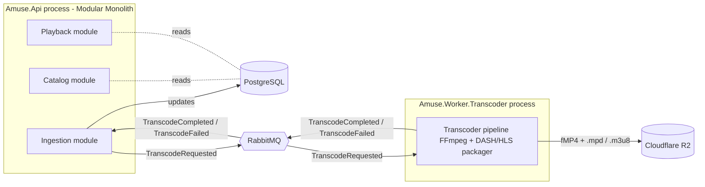
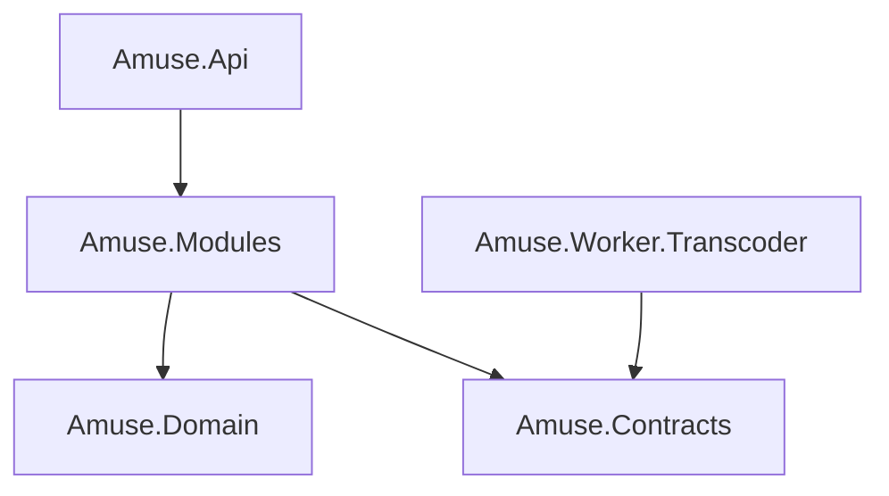

# Backend Structure — DDD + Vertical Slice (Modular Monolith)

This document is the source of truth for how the Amuse backend solution is laid out: which bounded contexts exist, which `.csproj` files exist, and how code inside each context is organized.

Conventions used in the trees below:

- `[P]` — a project (has its own `.csproj`).
- `[F]` — a folder (no `.csproj`); just a logical group inside a project.
- File names ending in `.cs` are concrete files; trailing `/` denotes a folder.

Architectural style:

- **DDD modular monolith**: one `Amuse.Api` host process composes ten bounded contexts, plus shared kernel and cross-cutting infrastructure.
- **Vertical slice per use case** (no CQRS, no MediatR). Each feature folder owns its endpoint, request/response DTOs, validator, and a plain handler service.
- **Single PostgreSQL database**, one EF Core `DbContext` per bounded context, each pinned to its own Postgres `schema`. Cross-context consistency is via the outbox + RabbitMQ, never cross-context joins.
- **Ingestion worker is a separate process** (`Amuse.Worker.Transcoder`). RabbitMQ sits between the Ingestion bounded context (producer + result consumer in the API) and the worker (consumer + result producer). The worker depends only on `Amuse.Contracts`.
- **No .NET Aspire**. Local orchestration is Docker Compose only.

---

## 1. Bounded contexts

Derived from `design/context/*.md`, [design/docs/schema-spec.md](../design/docs/schema-spec.md), [ads/auth/auth-index.md](auth/auth-index.md), and [ads/audit.md](audit.md).

| # | Bounded context | Owns (tables) | Postgres schema | Notes |
|---|---|---|---|---|
| 1 | **Identity** | `account`, `refresh_session`, `token_blacklist` | `identity` | Thin facade over an external identity provider; this BC only stores `Account` profile + session/token state, not credentials. |
| 2 | **Tenancy** | `organization`, `organization_member` | `tenancy` | Owns claims-based ACL, preset roles (UI-only), forced-owner rules per `ads/auth/auth-index.md`. |
| 3 | **Catalog** | `release_group`, `release`, `track` | `catalog` | Pure metadata. No audio assets here. |
| 4 | **Ingestion** | `track_asset` (master + renditions), upload intent rows | `ingestion` | RabbitMQ producer (`TranscodeRequested`) and consumer (`TranscodeCompleted` / `TranscodeFailed`). Drives Track/Release status transitions. |
| 5 | **Playback** | `playback_session`, `edge_token_audit`, `cdn_purge_request` | `playback` | Issues short-lived playback JWTs; talks to Cloudflare Worker + R2 purge API. |
| 6 | **Telemetry** | `playback_event` (time-partitioned monthly), `search_rank_snapshot` | `telemetry` | Feeds Billing settlement (>= 30s rule) and Discovery ranking. |
| 7 | **Discovery** | `listener_preference`, `playlist`, `playlist_item` | `discovery` | Search, browse, playlist CRUD. |
| 8 | **Moderation** | `moderation_report`, `moderation_action` | `moderation` | Auto-hide on >= 5 valid reports, manual review queue. |
| 9 | **Billing** | `subscription`, `payment_tx`, `ledger_journal`, `ledger_entry`, `settlement_run`, `payout_statement` | `billing` | Mock payment provider, double-entry ledger, monthly settlement. |
| 10 | **Recommendation** *(DA1 stub)* | `rec_feature_snapshot`, `ml_model_version`, `rec_serving_log` | `recommendation` | Heuristic-only in DA1. Schema reserved for DA2 ML expansion. |

### Cross-cutting (NOT bounded contexts)

These live in `Amuse.Modules/Common` and are referenced by every BC module:

- **Audit** — centralized `audit_log` table written by an EF Core `SaveChangesInterceptor` (per [ads/audit.md](audit.md)). Schema `audit`. Modeled as a flat module (`Amuse.Modules/Audit`) because it has no use-case endpoints, only the interceptor and read endpoints for admin.
- **Tenant guard** — middleware reading `org_id` claim from access tokens.
- **Outbox** — transactional outbox table per BC schema (`<bc>.outbox_message`) for reliable RabbitMQ publishing.

---

## 2. Cross-context flow (RabbitMQ boundary)



The contracts (`TranscodeRequested`, `TranscodeCompleted`, `TranscodeFailed`, `RenditionDescriptor`) live in `Amuse.Contracts`, so the worker never references `Amuse.Modules` or `Amuse.Domain`.

---

## 3. Solution / project tree

```
amuse/                                                  [F]
├── amuse.sln                                           (top-level solution)
├── compose.yaml                                        (top-level: API + Worker + PG + RabbitMQ + MinIO/R2 stub + otel-collector)
├── ads/                                                [F] product/architecture source-of-truth docs
├── design/                                             [F] AI-generated reference (NOT authoritative)
├── frontend/                                           [F] (out of scope for this doc)
├── infrastructure/                                     [F] Terraform / k8s manifests (out of scope for this doc)
└── backend/                                            [F]
    ├── backend.slnx                                    (backend-only solution view)
    ├── compose.yaml                                    (backend-local: postgres, rabbitmq, minio, otel-collector)
    ├── .dockerignore
    ├── src/                                            [F]
    │   ├── Amuse.Domain/                               [P] Amuse.Domain.csproj
    │   │   ├── SharedKernel/                           [F] Entity, AggregateRoot, ValueObject, DomainEvent, Result, Money, Guards
    │   │   ├── Identity/                               [F] Account, RefreshSession, TokenBlacklistEntry, AccountStatus
    │   │   ├── Tenancy/                                [F] Organization, OrganizationMember, ClaimSet, OrganizationClass, ApprovalStatus
    │   │   ├── Catalog/                                [F] ReleaseGroup, Release, Track, ReleaseStatus, TrackStatus, ReleaseType
    │   │   ├── Ingestion/                              [F] TrackAsset, AssetKind, UploadIntent, IngestionStatus, RenditionLadder
    │   │   ├── Playback/                               [F] PlaybackSession, EdgeTokenGrant, CdnPurgeRequest, PurgeTriggerType
    │   │   ├── Telemetry/                              [F] PlaybackEvent, EventType, SearchRankSnapshot, ValidStreamRule
    │   │   ├── Discovery/                              [F] Playlist, PlaylistItem, ListenerPreference, PlaylistVisibility
    │   │   ├── Moderation/                             [F] ModerationReport, ModerationAction, ReportStatus, ActionType
    │   │   ├── Billing/                                [F] Subscription, PaymentTransaction, LedgerJournal, LedgerEntry, SettlementRun, PayoutStatement, JournalType, EntryDirection
    │   │   ├── Recommendation/                         [F] RecFeatureSnapshot, MlModelVersion, RecServingLog
    │   │   └── Audit/                                  [F] AuditEntry, AuditAction
    │   │
    │   ├── Amuse.Modules/                              [P] Amuse.Modules.csproj
    │   │   ├── Common/                                 [F]
    │   │   │   ├── Persistence/                        [F] ModuleDbContextBase.cs, AuditingInterceptor.cs, OutboxInterceptor.cs, TenantQueryFilter.cs, OutboxMessage.cs
    │   │   │   ├── Messaging/                          [F] IBusPublisher.cs, IBusConsumer.cs, RabbitMqPublisher.cs, RabbitMqConsumerHostedService.cs, OutboxProcessor.cs
    │   │   │   ├── Authorization/                      [F] TenantGuardMiddleware.cs, ClaimsPolicyHandler.cs, OrgScopeAccessor.cs, RequireClaimAttribute.cs
    │   │   │   ├── Endpoints/                          [F] IEndpointModule.cs, EndpointRouteBuilderExtensions.cs, ProblemDetailsMappingExtensions.cs, ValidationFilter.cs
    │   │   │   ├── Validation/                         [F] FluentValidation hooks, IValidatorAdapter
    │   │   │   └── Time/                               [F] IClock.cs, SystemClock.cs
    │   │   │
    │   │   ├── Identity/                               [F]
    │   │   │   ├── IdentityModule.cs                   (AddIdentityModule + MapIdentityModule)
    │   │   │   ├── Persistence/                        [F] IdentityDbContext.cs, Configurations/, Migrations/
    │   │   │   ├── Services/                           [F] IIdentityProvider.cs, TokenIssuer.cs, RefreshSessionService.cs
    │   │   │   └── Features/                           [F]
    │   │   │       ├── Login/                          [F] LoginEndpoint.cs, LoginRequest.cs, LoginResponse.cs, LoginHandler.cs, LoginValidator.cs
    │   │   │       ├── RefreshToken/                   [F] (same 5-file pattern)
    │   │   │       ├── RevokeToken/                    [F]
    │   │   │       └── GetCurrentAccount/              [F]
    │   │   │
    │   │   ├── Tenancy/                                [F]
    │   │   │   ├── TenancyModule.cs
    │   │   │   ├── Persistence/                        [F] TenancyDbContext.cs, Configurations/, Migrations/
    │   │   │   ├── Services/                           [F] ClaimsResolver.cs, OwnershipPolicy.cs
    │   │   │   └── Features/                           [F] CreateOrganization/, InviteMember/, AssignClaims/, TransferOwnership/, RemoveMember/, ListMembers/
    │   │   │
    │   │   ├── Catalog/                                [F]
    │   │   │   ├── CatalogModule.cs
    │   │   │   ├── Persistence/                        [F] CatalogDbContext.cs, Configurations/, Migrations/
    │   │   │   └── Features/                           [F] CreateRelease/, AddTrack/, PublishRelease/, GetRelease/, BrowseCatalog/, HideRelease/
    │   │   │
    │   │   ├── Ingestion/                              [F]
    │   │   │   ├── IngestionModule.cs
    │   │   │   ├── Persistence/                        [F] IngestionDbContext.cs, Configurations/, Migrations/
    │   │   │   ├── Storage/                            [F] IMasterFileStorage.cs, R2MasterFileStorage.cs
    │   │   │   ├── Messaging/                          [F] TranscodeRequestedPublisher.cs, TranscodeResultConsumer.cs
    │   │   │   └── Features/                           [F] InitiateUpload/, ConfirmMasterUploaded/, HandleTranscodeCompleted/, HandleTranscodeFailed/, ListAssetsForTrack/
    │   │   │
    │   │   ├── Playback/                               [F]
    │   │   │   ├── PlaybackModule.cs
    │   │   │   ├── Persistence/                        [F] PlaybackDbContext.cs, Configurations/, Migrations/
    │   │   │   ├── EdgeTokens/                         [F] PlaybackJwtIssuer.cs, EdgeTokenClaims.cs
    │   │   │   ├── Cdn/                                [F] ICdnPurgeClient.cs, CloudflarePurgeClient.cs
    │   │   │   └── Features/                           [F] StartPlayback/, IssueEdgeToken/, EndSession/, RequestCdnPurge/
    │   │   │
    │   │   ├── Telemetry/                              [F]
    │   │   │   ├── TelemetryModule.cs
    │   │   │   ├── Persistence/                        [F] TelemetryDbContext.cs, Configurations/, Migrations/, Partitions/
    │   │   │   └── Features/                           [F] IngestPlaybackEvent/, ComputeSearchRankSnapshot/, GetTrackPlayStats/
    │   │   │
    │   │   ├── Discovery/                              [F]
    │   │   │   ├── DiscoveryModule.cs
    │   │   │   ├── Persistence/                        [F] DiscoveryDbContext.cs, Configurations/, Migrations/
    │   │   │   └── Features/                           [F] Search/, GetHome/, CreatePlaylist/, AddTrackToPlaylist/, RemoveTrackFromPlaylist/, GetListenerPreferences/, UpdateListenerPreferences/
    │   │   │
    │   │   ├── Moderation/                             [F]
    │   │   │   ├── ModerationModule.cs
    │   │   │   ├── Persistence/                        [F] ModerationDbContext.cs, Configurations/, Migrations/
    │   │   │   └── Features/                           [F] FileReport/, AutoHideOnThreshold/, ManualReview/, RestoreTrack/, ListOpenReports/
    │   │   │
    │   │   ├── Billing/                                [F]
    │   │   │   ├── BillingModule.cs
    │   │   │   ├── Persistence/                        [F] BillingDbContext.cs, Configurations/, Migrations/
    │   │   │   ├── Mock/                               [F] MockPaymentProvider.cs, MockCallbackEndpoint.cs
    │   │   │   ├── Settlement/                         [F] SettlementEngine.cs, ValidStreamGate.cs, JournalPoster.cs
    │   │   │   └── Features/                           [F] StartCheckout/, HandleMockCallback/, RunSettlement/, GeneratePayoutStatement/, ListPayoutStatements/, GetSubscriptionStatus/
    │   │   │
    │   │   ├── Recommendation/                         [F] (DA1 stub)
    │   │   │   ├── RecommendationModule.cs
    │   │   │   ├── Persistence/                        [F] RecommendationDbContext.cs, Configurations/, Migrations/
    │   │   │   └── Features/                           [F] GetTrendingTracks/, GetForYouHeuristic/, LogServingDecision/
    │   │   │
    │   │   └── Audit/                                  [F] (cross-cutting persisted log)
    │   │       ├── AuditModule.cs
    │   │       ├── Persistence/                        [F] AuditDbContext.cs, AuditEntryConfiguration.cs, Migrations/
    │   │       └── Features/                           [F] QueryAuditLog/   (admin read-only)
    │   │
    │   ├── Amuse.Contracts/                            [P] Amuse.Contracts.csproj   (shared by Api + Worker)
    │   │   ├── Common/                                 [F] MessageEnvelope.cs, MessageHeaders.cs, ContractVersion.cs
    │   │   └── Ingestion/                              [F] TranscodeRequested.cs, TranscodeCompleted.cs, TranscodeFailed.cs, RenditionDescriptor.cs, AssetKind.cs
    │   │
    │   ├── Amuse.Api/                                  [P] Amuse.Api.csproj   (host; thin composition root)
    │   │   ├── Program.cs                              (calls AddXxxModule + MapXxxModule for every BC; nothing else)
    │   │   ├── appsettings.json
    │   │   ├── appsettings.Development.json
    │   │   ├── Properties/
    │   │   │   └── launchSettings.json
    │   │   ├── Endpoints/
    │   │   │   └── ApiVersioning.cs
    │   │   ├── Amuse.Api.http
    │   │   └── Dockerfile
    │   │
    │   └── Amuse.Worker.Transcoder/                    [P] Amuse.Worker.Transcoder.csproj   (separate process)
    │       ├── Program.cs                              (Generic Host + RabbitMQ consumers)
    │       ├── appsettings.json
    │       ├── Consumers/
    │       │   └── TranscodeRequestedConsumer.cs
    │       ├── Pipeline/                               [F] FfmpegRunner.cs, DashPackager.cs, HlsPackager.cs, ManifestWriter.cs, RenditionLadder.cs
    │       ├── Storage/
    │       │   └── R2Uploader.cs
    │       ├── Messaging/
    │       │   └── TranscodeResultPublisher.cs
    │       └── Dockerfile
    │
    └── tests/                                          [F]   one csproj per BC, mirrors src/
        ├── Amuse.Domain.Tests/                         [P]   pure domain tests (no infra), folders mirror Amuse.Domain BC folders
        ├── Amuse.Modules.Identity.Tests/               [P]
        ├── Amuse.Modules.Tenancy.Tests/                [P]
        ├── Amuse.Modules.Catalog.Tests/                [P]
        ├── Amuse.Modules.Ingestion.Tests/              [P]
        ├── Amuse.Modules.Playback.Tests/               [P]
        ├── Amuse.Modules.Telemetry.Tests/              [P]
        ├── Amuse.Modules.Discovery.Tests/              [P]
        ├── Amuse.Modules.Moderation.Tests/             [P]
        ├── Amuse.Modules.Billing.Tests/                [P]
        ├── Amuse.Modules.Recommendation.Tests/         [P]
        ├── Amuse.Worker.Transcoder.Tests/              [P]
        └── Amuse.Api.IntegrationTests/                 [P]   end-to-end against Testcontainers (PG + RabbitMQ + MinIO)
```

### Project count summary

- 5 source projects: `Amuse.Domain`, `Amuse.Modules`, `Amuse.Contracts`, `Amuse.Api`, `Amuse.Worker.Transcoder`.
- 13 test projects: 1 for Domain, 10 per-BC for Modules, 1 for Worker, 1 for end-to-end Api integration.

---

## 4. Project reference graph

Allowed references only. Anything outside this graph is a violation and should fail review (can be enforced later via ArchUnitNET or `Microsoft.CodeAnalysis.BannedApiAnalyzers`).



Hard rules:

- `Amuse.Domain` references **nothing** (no EF Core, no ASP.NET, no RabbitMQ). Pure C#.
- `Amuse.Contracts` references **nothing** (POCOs only; serialization-friendly).
- `Amuse.Modules` references `Amuse.Domain` and `Amuse.Contracts`. It is the only project that depends on EF Core, RabbitMQ.Client, FluentValidation, R2 SDK, Cloudflare client, etc.
- `Amuse.Api` references `Amuse.Modules` only. It is a composition root: `Program.cs`, configuration, hosting middleware, OpenAPI.
- `Amuse.Worker.Transcoder` references `Amuse.Contracts` only. **It must NOT reference `Amuse.Domain` or `Amuse.Modules`.** This guarantees the queue is the real boundary, not just a runtime artifact.

Inside `Amuse.Modules`, BC folders should not reference each other directly. Cross-BC communication goes through:

1. **Domain events** raised by an aggregate, dispatched in-process via the outbox interceptor.
2. **Integration events** published to RabbitMQ (used by Ingestion <-> Worker today; available for any future BC that needs async fan-out).
3. **Read-only queries** against another BC's read-side, exposed via a small `IXxxReadModel` interface in that BC's `Services/` folder. Never reach into another BC's `DbContext` directly.

---

## 5. Per-BC vertical slice convention (no CQRS, no MediatR)

Each `Features/<UseCase>/` folder contains up to 5 files following the same pattern:

| File | Purpose |
|---|---|
| `<UseCase>Endpoint.cs` | Minimal API mapping. One method, thin: parse route, call handler, map `Result<T>` to `IResult`. |
| `<UseCase>Request.cs` | Input DTO (record). |
| `<UseCase>Response.cs` | Output DTO (record). |
| `<UseCase>Handler.cs` | Plain DI service (NOT `IRequestHandler`). One public method, e.g. `Task<Result<CreateReleaseResponse>> HandleAsync(CreateReleaseRequest, CancellationToken)`. |
| `<UseCase>Validator.cs` | Optional FluentValidation validator, run by `ValidationFilter` from `Common/Endpoints/`. |

What this looks like end-to-end:

1. The endpoint resolves `Handler` from DI, calls one public method, returns a `Result<T>` mapped to `IResult` / RFC 7807 `ProblemDetails`.
2. No `IMediator`, no `IRequest<T>`, no pipeline behaviors. Cross-cutting concerns (validation, logging, tenant guard) are endpoint filters or middleware, not Mediator pipeline behaviors.
3. Domain logic stays inside aggregates in `Amuse.Domain/<BC>/`. Handlers orchestrate aggregates, repositories, the BC `DbContext`, and RabbitMQ publishers — they do not contain business rules.

### Module wiring

`<BC>Module.cs` is a static class with two extension methods:

```csharp
public static IServiceCollection AddCatalogModule(this IServiceCollection services, IConfiguration configuration);
public static IEndpointRouteBuilder  MapCatalogModule(this IEndpointRouteBuilder endpoints);
```

`AddCatalogModule` registers handlers, validators, the `CatalogDbContext`, repositories, the BC's outbox processor, and any external clients. `MapCatalogModule` maps every feature endpoint under `/api/v1/catalog`.

`Amuse.Api/Program.cs` is the only place that lists the full module set:

```csharp
builder.Services
    .AddIdentityModule(builder.Configuration)
    .AddTenancyModule(builder.Configuration)
    .AddCatalogModule(builder.Configuration)
    .AddIngestionModule(builder.Configuration)
    .AddPlaybackModule(builder.Configuration)
    .AddTelemetryModule(builder.Configuration)
    .AddDiscoveryModule(builder.Configuration)
    .AddModerationModule(builder.Configuration)
    .AddBillingModule(builder.Configuration)
    .AddRecommendationModule(builder.Configuration)
    .AddAuditModule(builder.Configuration);

// ...

app.MapIdentityModule()
   .MapTenancyModule()
   .MapCatalogModule()
   // ... etc.
```

---

## 6. EF Core layout (to be added later)

The structure is pre-stubbed so EF Core can drop in without rearrangement.

- One `DbContext` per BC under `Modules/<BC>/Persistence/<BC>DbContext.cs`. All point at the **same** Postgres connection string but call `modelBuilder.HasDefaultSchema("<bc_schema>")`.
- One migrations folder per BC (`Persistence/Migrations/`). Each BC has its own migration history table (`__EFMigrationsHistory_<bc>`) inside its schema, so BCs can be migrated independently without cross-BC coupling.
- `ModuleDbContextBase` (in `Common/Persistence/`) provides:
  - `AuditingInterceptor` — writes to `audit.audit_log` automatically on every `SaveChanges` per [ads/audit.md](audit.md).
  - `OutboxInterceptor` — writes outbox rows in the same DB transaction as aggregate changes.
  - `TenantQueryFilter` — applies `WHERE organization_id = @currentOrgId` to all tenant-bound entities, sourced from `OrgScopeAccessor`.
- Cross-BC consistency uses **outbox + RabbitMQ events**, never cross-BC `DbContext` joins. If a BC needs a read-only view of another BC's data, expose it through a small interface in that BC's `Services/` folder (e.g. `ICatalogReadModel.GetTrack(...)`) and let the other BC depend on the interface, not the table.
- `Amuse.Worker.Transcoder` does **not** use EF Core. It operates purely on RabbitMQ messages and R2 storage.
- `playback_event` is partitioned monthly per [design/docs/schema-spec.md](../design/docs/schema-spec.md) §5; the partition definitions live in `Modules/Telemetry/Persistence/Partitions/` and are applied via raw SQL migrations.

---

## 7. Conventions to pin

- **Endpoint base path**: `/api/v1/<bc-kebab>` (e.g. `/api/v1/catalog/releases`, `/api/v1/playback/sessions`).
- **Error model**: RFC 7807 `ProblemDetails` everywhere; a `Result<T>` -> `IResult` mapping helper lives in `Common/Endpoints/ProblemDetailsMappingExtensions.cs`.
- **Auth**: access tokens carry `sub`, `org_id`, `org_role` (preset name, UI-only), and `claims[]`. `TenantGuardMiddleware` denies any tenant-bound request lacking `org_id`. Refresh tokens carry only `sub`.
- **RabbitMQ client**: `RabbitMQ.Client` directly, plus a thin `IBusPublisher` / `IBusConsumer` abstraction in `Common/Messaging/`. **No MassTransit** — it ships Mediator-shaped APIs that conflict with this codebase's "no Mediator" rule.
- **Validation**: `FluentValidation` per feature; a `ValidationFilter` endpoint filter in `Common/Endpoints/` runs the validator before the handler.
- **Time**: never use `DateTime.UtcNow` directly in handlers — inject `IClock` from `Common/Time/`.
- **Tests**: each `Amuse.Modules.<BC>.Tests` project covers handlers + domain + persistence with Testcontainers Postgres. `Amuse.Domain.Tests` is pure unit tests (no Testcontainers). `Amuse.Api.IntegrationTests` boots the full host with Testcontainers Postgres + RabbitMQ + MinIO.

---

## 8. Why these choices

- **Grouped projects (5 source csprojs) instead of one csproj per BC**: keeps the project graph small enough to navigate quickly, while `Amuse.Domain` vs `Amuse.Modules` still enforces the "domain has no infra dependencies" rule at compile time. Per-BC isolation is enforced by convention (folder boundaries + reference rules in §4).
- **Worker as a separate process from day one**: the FFmpeg path is CPU-heavy and per [design/context/context.md](../design/context/context.md) message 04 must be async. Splitting it now means we never accidentally couple ingestion HTTP requests to FFmpeg runtime, and the worker can scale on its own node pool in K3s/AKS.
- **No CQRS / MediatR**: handlers are plain services. Vertical slice still applies — each feature is self-contained — but without the `IRequest<T>` ceremony. This matches the user's explicit constraint and keeps stack traces straightforward.
- **One DB, one schema per BC**: simple to operate (per [design/docs/schema-spec.md](../design/docs/schema-spec.md) §1), strict logical isolation via schemas, and migration histories stay independent. DA2 microservice splits become "move a schema to its own DB" rather than "untangle a god database".
- **No .NET Aspire**: per the user's request to keep deep infra control via Compose. Aspire's local orchestration would shadow the real Compose / K3s setup we want to validate against.
