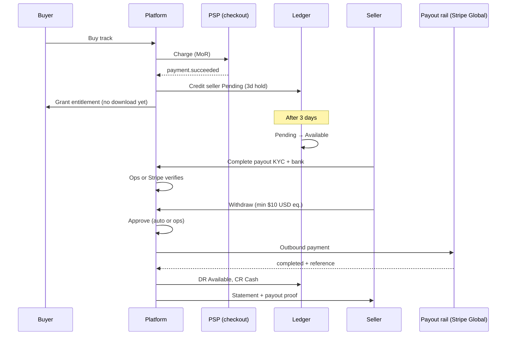

# Payments, purchases, and seller payouts

**Platform is merchant of record (MoR)** → buyer pays Amuse → Amuse grants entitlement → internal ledger credits sellers → after **3-day hold** funds become withdrawable → seller completes **payout onboarding (KYC + bank)** → withdrawal via **Stripe Global Payouts** (auto) or **manual bank transfer** (unsupported destinations).

That is a normal marketplace pattern, not a workaround.

## Locked product decisions

| # | Decision |
|---|----------|
| 1 | **MoR = Amuse.** Seller grants distribution/sale rights; buyer receipt is from Amuse. |
| 2 | **Refunds:** buyer-initiated refunds are **not** allowed (streaming lossless would make “no download” unenforceable). Only **platform operators** or the **seller org** may initiate a refund. Operator override always allowed with audit reason. |
| 3 | **Hold:** 3 calendar days from `paid_at` before seller funds move Pending → Available. |
| 4 | **Multi-currency ledger;** minimum withdrawal **$10 USD equivalent** (1000 USD cents at request time). |
| 5 | **KYC + bank onboarding required** before first withdrawal (Gate B — see §5). Earnings accrue before Gate B completes. |
| 6 | **Checkout:** VN local PSP and/or Stripe (sandbox first). **Payout:** Stripe Global Payouts where supported; **manual** transfer + proof for unsupported banks (hybrid). |
| 7 | **After-payout refund:** claw back from seller balance; if insufficient, create **SellerReceivable** and chase seller (do not absorb platform loss by default). |
| 8 | **Indie groups and backing orgs** both may sell purchases and withdraw (subject to Gate A publish rules + Gate B payout profile). |
| 9 | **Stripe entity:** prefer **Singapore** (`SG`) platform account for APAC alignment; use Stripe sandbox first; VN-market checkout compatibility is optional (local PSP hybrid). |

---

## **1. Platform as MoR (you sell on their behalf)**

Implications:


| **Area**                | **What it means**                                                                                                         |
| ----------------------- | ------------------------------------------------------------------------------------------------------------------------- |
| **Buyer receipt**       | Invoice/receipt is from **Amuse**, not the artist org                                                                     |
| **Legal relationship**  | Seller grants you distribution/sale rights; they earn **royalties/commissions**, not direct sale proceeds                 |
| **Refunds/chargebacks** | Hit **your** PSP balance first; you claw back from seller ledger (`pending` → `available`)                                |
| **Tax**                 | You may owe VAT/sales tax on the retail price (jurisdiction-dependent); seller payouts may need withholding/tax reporting |
| **Ledger wording**      | Use accounts like `PlatformCash`, `SellerPayablePending`, `SellerPayableAvailable`, `PlatformRevenue`, `RefundLiability`  |


Journal on purchase (simplified):

DR  PSP clearing / cash          (gross)

CR  Seller payable (pending)     (net to org, split by RoyaltySplit)

CR  Platform fee revenue          (your take)

This aligns with your planned Billing module and legacy `RoyaltySplit` idea.

---

## **2. Refunds (seller or platform only)**

Treat **entitlement** and **financial state** separately.

**Why no buyer-initiated refunds:** lossless streaming (e.g. FLAC segments) can be captured and reassembled; “not downloaded yet” is not a reliable buyer-facing gate. Refunds are a **support/compliance** action, not self-service.

**Who may initiate:**

| Initiator | Claim / rule | Notes |
|-----------|--------------|-------|
| Platform operator | `manage:platform:…` or dedicated refund claim | Always allowed; audit reason required |
| Seller org | e.g. `manage:purchase:refund` on owning org | Optional DA1; useful for direct fan support |

**Purchase aggregate** should track at least:

- `payment_status`: pending / paid / refunded / partially_refunded
- `entitlement_status`: active / revoked
- `refund_initiated_by`: account id + role (platform / seller)
- `refund_reason` (required text)

**Refund flow:**

1. Seller or operator initiates refund (API + audit entry).
2. Call PSP refund API.
3. On webhook success:
   - Revoke purchase entitlement (playback + any download/offline rights)
   - Post reversing ledger entries
   - Debit seller balance: `pending` first, then `available`
   - If seller already withdrawn and balance insufficient → post to **SellerReceivable** (negative balance / recovery queue)

Purchased-track **streaming** is part of the product; do not use “first download” as the refund gate — refunds are simply not buyer-triggered.

---

## **3. Three-day hold**

Do **not** pay sellers on payment webhook. Credit **pending** immediately; release on schedule.

paid_at + 3 days → move Pending → Available

Implementation:

- Each seller credit line gets `available_at` timestamp.
- Nightly/hourly job posts transfer journals: `DR SellerPayablePending`, `CR SellerPayableAvailable`.
- Refunds during hold: reverse pending balance (no clawback from bank needed).
- Chargebacks after release: debit available or create `SellerReceivable` if insufficient.

Hold is independent of withdrawal onboarding — sellers can accumulate `available` balance before KYC; they just cannot withdraw until verified.

---

## **4. Multi-currency + $10 USD minimum**

**Store everything in minor units + ISO currency** (`amount_minor`, `currency`). Your design docs already use this pattern.

Two ledger strategies:


| **Strategy**                                 | **When to use**                            |
| -------------------------------------------- | ------------------------------------------ |
| **Separate sub-ledger per currency**         | Cleaner for VND + USD; recommended for you |
| **Single functional currency + FX journals** | Harder to audit; avoid unless required     |


**Minimum withdrawal: $10 USD equivalent**

At withdrawal request time:

1. Sum `available` balances (possibly multi-currency).
2. Convert to USD using a **published FX rate** (store `fx_rate_id`, source, timestamp on the withdrawal).
3. Reject if below 1000 USD cents equivalent.
4. Payout in **seller’s chosen payout currency** (usually their bank currency, e.g. VND) with FX handled by PSP or pre-converted.

Also enforce **per-currency PSP minimums** (Stripe Global Payouts has country minimums; Vietnam VND minimum is substantial per their docs — your $10 USD rule may still fail PSP minimum in VND on small withdrawals).

---

## **5. KYC / bank onboarding — how to actually do this**

You already have **org onboarding** (`pendingReview → approved`) in Tenancy. That is **platform trust to publish**, not **financial KYC to receive money**. Keep them separate.

### **Two gates**

```
Gate A (Tenancy — existing)     → org approved → publish & sell
Gate B (Billing — new)          → payout profile verified → request withdrawal
```

Sellers can earn through Gate A while Gate B is incomplete. Business portal shows balance + **“Complete payout setup to withdraw.”**

### **New aggregate: `PayoutProfile` (per Organization)**

Lives in **Billing** bounded context (not Tenancy). One profile per org; indie groups and backing orgs use the same flow.

| Field | Purpose |
|-------|---------|
| `legal_entity_type` | `individual` / `company` |
| `legal_name`, `address`, `country` | KYC |
| `tax_id` (encrypted at rest) | compliance |
| `representative` | required for companies |
| `payout_rail` | `stripe_global` / `manual_bank` |
| `bank_account` (encrypted; API returns masked + last4) | destination |
| `verification_status` | `not_started` → `submitted` → `under_review` → `verified` / `rejected` |
| `external_recipient_id` | Stripe Global Payouts recipient id (when `stripe_global`) |
| `document_object_keys[]` | private storage refs for ID / business reg uploads |
| `verified_at`, `verified_by` | audit (ops account id or `system:stripe`) |

**Claims (add to `ads/auth/permissions.md` when implementing):**

- `manage:payout:profile:all` — org owner submits/updates payout profile
- `read:payout:all` — view balance, statements (already planned)
- `manage:payout:withdraw:all` — request withdrawal (owner only by default)

### **Concrete UX flow (what “having KYC” means in the product)**

**Step 1 — Seller opens “Payout setup” in business portal**

- Chooses individual vs company.
- Enters legal name, address, country, tax id.
- Chooses payout method:
  - **Stripe-supported bank** → `payout_rail = stripe_global` (redirect to Stripe-hosted collection in Phase 2).
  - **Other bank** → `payout_rail = manual_bank`; upload bank details + bank statement or voided cheque scan.

**Step 2 — Document upload**

- Individual: government ID (CCCD/passport).
- Company: business registration + authorized representative ID.
- Files → private object storage (same pattern as master uploads); never returned in API except signed short-lived download for ops review.

**Step 3 — Verification**

| Rail | DA1 | DA2+ |
|------|-----|------|
| `manual_bank` | Platform ops queue (`/platform/payout-profiles`) reviews docs + bank details; approve/reject | Optional penny-test micro-deposit |
| `stripe_global` | Ops can still pre-review; or stub until Stripe connected | Stripe Account Link collects identity + bank; webhooks set `verified` |

**Step 4 — Gate**

- `verification_status = verified` → org may call `POST /withdrawals`.
- Until then: show accrued `available` balance but disable withdraw button with CTA to complete setup.

### **Implementation tiers**

**Phase 1 — Manual (DA1 / Stripe sandbox for checkout only)**

1. Business portal form + document upload.
2. Platform ops review queue (mirror backing-org approval UX).
3. Withdrawals → `WithdrawalRequest` ticket → finance manual transfer → ops marks `completed` with bank reference + optional proof file.
4. Full audit trail.

**Phase 2 — Stripe recipient onboarding (payout rail)**

- Platform Stripe account registered in **Singapore**.
- Create recipient via Stripe Global Payouts / Accounts v2 API (`identity.country` = seller country).
- **Account Link** for hosted KYC + bank collection.
- Webhooks (`account.updated`, outbound payment events) update `PayoutProfile` and `WithdrawalRequest`.
- Outbound payments via **Outbound Payments API**.

Gate A (org approval) remains yours; Gate B identity verification is delegated to Stripe for `stripe_global` rail.

**Phase 3 — Automation**

- Auto-approve withdrawals under threshold when `stripe_global` + verified.
- Daily batch outbound payments.
- Reconciliation job: PSP payout status ↔ ledger.

### **What to collect (Vietnam minimum; extend per country)**

**Individual:** legal name, DOB, address, phone, email, CCCD/passport, bank account + bank name (+ branch / SWIFT for wire).

**Organization:** company legal name, registration number, address, representative + ID, business bank account.

### **KYC provider options**

| Approach | Effort | Notes |
|----------|--------|-------|
| Manual ops review | Low | DA1 default; required for `manual_bank` rail |
| Stripe Account Links | Medium | Gate B for `stripe_global` rail |
| Sumsub / Onfido / Persona | Medium–High | Optional extra ID+liveness before Stripe; usually unnecessary if Stripe collects identity |

Bank verification without PSP instant check: **bank statement upload** (DA1) or **penny test** (send small amount, seller confirms code).

---

## **6. VN checkout + international payout (Stripe hybrid)**

VN market reality: **many PSPs do collection; few do seller payouts**. Use a **split rail** model:

```
COLLECT (buyer pays)              DISBURSE (seller paid)
─────────────────────             ───────────────────────
Stripe Checkout (SG entity)       ├─ stripe_global → Stripe Global Payouts (auto)
  sandbox first, cards            │
VN local PSP (optional, DA2+)     └─ manual_bank → ops wire + reference (manual)
        │                                    ▲
        └──── funds → platform balance ──────┘
              (Stripe balance / company bank)
```

### **Stripe entity: Singapore**

Prefer a **Stripe platform account in Singapore** because:

- APAC-friendly entity for Global Payouts to regional banks (including cross-border to VN).
- English/support timezone alignment for DA2 ops.
- Sandbox available immediately for purchase + payout integration testing.

**Caveats:** confirm with Stripe which **buyer** payment methods and currencies your SG account can accept; VN-local wallets (MoMo, VNPay) still likely need a **local collection PSP** in DA2, with settlement into your company bank → fund Stripe or pay sellers manually.

### **Collection options**

1. **Stripe Checkout** (DA1 sandbox, then live SG entity) — cards, multi-currency.
2. **VN local gateway** (optional DA2) — VNPay, MoMo, ZaloPay, PayOS for VND; webhook → same ledger posting.

Normalize all collections to ledger in **currency received** (`amount_minor` + ISO code).

### **Payout options (hybrid)**

| `payout_rail` | When | How |
|---------------|------|-----|
| `stripe_global` | Seller bank supported by Stripe Global Payouts for their country | Outbound Payments API after Gate B via Account Link |
| `manual_bank` | Unsupported bank/country or DA1 | Withdrawal ticket → finance manual transfer → `completed` with `transfer_reference` + optional proof artifact |

**Stripe Global Payouts:** platform (SG) pays **recipients** you onboard — fits MoR (you sold the track; you pay royalties). This is **not** standard Connect marketplace split-at-charge.

**Do not assume Stripe Connect marketplace onboarding for VN connected accounts** covers both sides; Global Payouts + internal ledger is the correct model here.

Alternatives if Stripe outbound is unavailable for a corridor: Wise Business batch, Payoneer, or manual wire (Phase 1).

---

## **End-to-end flow with your rules**


---

## **How this maps to Amuse today**

You already have pieces to reuse:

- **Gate A:** `OrganizationOnboardingStatus` + platform approve flow (`ai-docs/backend/tenancy-organizations.md`)
- **Payout read claim:** `read:payout:all` on approved backing orgs
- **Planned Billing:** ledger, settlement runs, payout statements (`ads/backend-structure.md`)
- **Legacy schema:** `Purchase`, `RoyaltySplit`, `Withdrawal` — still valid; add fulfillment/download tracking and payout profile

What you still need (new work):


| **Component**                            | **Purpose**                  |
| ---------------------------------------- | ---------------------------- |
| `Purchase` + entitlement/download events | Buy flow + refund rules      |
| `PayoutProfile`                          | KYC + bank (Gate B)          |
| `WithdrawalRequest`                      | Ticket + approval + proof    |
| Ledger accounts with Pending/Available   | 3-day hold                   |
| FX rate table                            | Multi-currency minimum       |
| PSP adapters                             | Checkout + outbound payments |


DA1 scope note: your implementation plan explicitly puts **real payment gateway legal onboarding** out of scope — so Phase 1 manual KYC + mock/manual payout is consistent; design the domain model now so Stripe plugs in later without rework.

---

## **Suggested phasing**


| **Phase** | **Checkout**             | **Seller onboarding**               | **Payout**                       |
| --------- | ------------------------ | ----------------------------------- | -------------------------------- |
| **DA1**   | Mock or one VN PSP spike | Manual form + ops review queue      | Manual bank transfer + reference |
| **DA2**   | Stripe + local VN PSP    | Stripe Account Links for recipients | Stripe Global Payouts batch      |
| **Scale** | Full multi-currency      | Automated KYC vendor                | Auto withdrawal above threshold  |


---

## **Open items (minor — decide during implementation)**

1. **Seller-initiated refund claim:** exact claim string and whether indie groups get it by default on owner preset.
2. **Streaming royalty vs purchase:** monthly stream settlement and per-purchase credits share the same `SellerPayable*` accounts or separate sub-accounts — recommend same org balance, different journal `reference_type`.
3. **FX rate source:** ECB daily, Stripe FX quote at withdrawal, or manual ops table for DA1.
4. **Seller payout currency:** seller chooses among currencies/banks supported by their selected `payout_rail` (Stripe-supported list vs manual free-text bank details).
