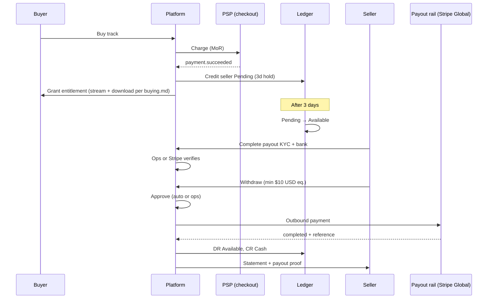

# Payments, purchases, and seller payouts

**Platform is merchant of record (MoR)** → buyer pays Amuse → Amuse grants entitlement → internal ledger credits sellers → after **3-day hold** funds become withdrawable → seller completes **payout onboarding (KYC + bank)** → withdrawal via **Stripe Global Payouts** (auto) or **manual bank transfer** (unsupported destinations).

That is a normal marketplace pattern, not a workaround.

**Consumer buy flow and entitlements:** [buying.md](buying.md) (DA1: purchases only, no subscriptions).

## Locked product decisions

| # | Decision |
|---|----------|
| 1 | **MoR = Amuse.** Seller grants distribution/sale rights; buyer receipt is from Amuse. |
| 2 | **Refunds:** buyer-initiated refunds are **not** allowed (streaming lossless would make “no download” unenforceable). Only **platform operators** or the **seller org** may initiate a refund. Operator override always allowed with audit reason. |
| 3 | **Hold:** 3 calendar days from `paid_at` before seller funds move Pending → Available. |
| 4 | **Multi-currency ledger;** minimum withdrawal **$10 USD equivalent** (1000 USD cents at request time). |
| 5 | **KYC + bank onboarding required** before first withdrawal (Gate B — see §5). Earnings accrue before Gate B completes. |
| 6 | **Checkout:** VN local PSP and/or Stripe (sandbox first). **Payout:** Stripe Global Payouts where supported; **manual** transfer + proof for unsupported banks (hybrid). |
| 7 | **After-payout refund:** claw back from seller balance; if insufficient, create **SellerReceivable** and chase seller (do not absorb platform loss by default). |
| 8 | **Indie sell model (D+E):** indie groups may **publish and sell publicly** without backing-org approval. **Gate B** still required to withdraw. See §7. |
| 9 | **Stripe entity:** prefer **Singapore** (`SG`) platform account for APAC alignment; use Stripe sandbox first; VN-market checkout compatibility is optional (local PSP hybrid). |
| 10 | **Discovery trust:** unverified orgs (`trust_tier = unverified`, default indie) show an **unverified badge** and **lower search rank** vs platform-verified backing orgs. |
| 11 | **`read:payout:all` for indie:** indie owners get payout **read** (balance, statements). Withdraw remains gated by `manage:payout:withdraw` + Gate B — read does not imply disbursement. |
| 12 | **Fee waterfall:** **10% platform fee** (configurable) + **actual PSP fee** deducted from **gross** before **RoyaltySplit**; seller side bears PSP cost. See §8. |
| 13 | **RoyaltySplit:** per-track at publish; org-only; multi-org collabs; snapshot at purchase. See §9. |
| 14 | **Tax:** VAT **tax-inclusive** list prices; **10% VAT** (configurable); numbered **tax invoice**; seller gross royalties. Platform **accounting** role + ops screen. See §10. |
| 15 | **Chargebacks:** ban buyer **account + card**; no dispute fighting (out of scope). **Refund fees:** seller eats if seller-initiated; platform-initiated → operator picks bearer. See §2 + §11. |
| 16 | **Withdrawals:** auto-approve if verified + under threshold; partial OK; failed → return to available; bank change → re-KYC; **7-day cooldown**. See §12. |
| 17 | **FX:** ECB daily for min/validation; Stripe at payout; credit in **payment currency**; **seller bears** withdrawal FX spread; ops override in accounting. See §13. |
| 18 | **Ledger balance:** DA1 purchase-only earnings; DA2+ stream + purchase share **one org balance** per currency; combined withdrawals. See §14. |
| 19 | **Pricing & refunds claims:** PWYW pricing (`manage:catalog:pricing:all`); seller/platform refund claims. See §15 + [buying.md](buying.md). |
| 20 | **Org suspend/close:** suspend = earn blocked, withdraw if Gate B ok; close = withdraw until zero; freeze pending; block withdraw if receivable. See §16. |

---

## **7. Indie vs backing org — sell, discovery, capabilities**

### **Model: D + E (locked)**

| Gate | Indie group | Backing org (approved) |
|------|-------------|------------------------|
| **Gate A — list & sell** | Automatic (`onboarding notRequired`); may set price and **publish public** purchasable catalog | After platform org approval |
| **Gate B — withdraw** | `PayoutProfile` verified (same as backing org) | Same |
| **`trust_tier`** | Default `unverified` | `platformVerified` on approval |

Indie is not a second-class **seller** (can publish and earn). Backing-org approval is a **trust / discovery upgrade**, not a requirement to sell.

### **Discovery differences (locked)**

- **Unverified** (default indie): visible in search/catalog with **unverified seller badge**; **lower search rank** than verified orgs.
- **Platform-verified** (approved backing org): no unverified badge (or “verified” badge TBD in UI); normal/higher search rank treatment.

Search ranking mechanics live in Discovery; Billing/Tenancy only supply `trust_tier` for signals.

### **Capability changes (implementation note)**

Today `EvaluateCapabilities()` gives indie `publish_public` but **not** `read:payout`. **Change:** grant indie active orgs `CanReadPayout: true` alongside existing publish/upload/draft.

Withdrawal actions use separate claims (`manage:payout:withdraw:all`, Gate B verified profile) — not implied by `read:payout:all`.

Update `ai-docs/backend/tenancy-organizations.md` when implementing (indie row currently says “No” for payout read — stale vs code intent).

---

## **1. Platform as MoR (you sell on their behalf)**

Implications:


| **Area**                | **What it means**                                                                                                         |
| ----------------------- | ------------------------------------------------------------------------------------------------------------------------- |
| **Buyer receipt**       | Invoice/receipt is from **Amuse**, not the artist org                                                                     |
| **Legal relationship**  | Seller grants you distribution/sale rights; they earn **royalties/commissions**, not direct sale proceeds                 |
| **Refunds/chargebacks** | Hit **your** PSP balance first; you claw back from seller ledger (`pending` → `available`)                                |
| **Tax**                 | You may owe VAT/sales tax on the retail price (jurisdiction-dependent); seller payouts may need withholding/tax reporting |
| **Ledger wording**      | Use accounts like `PlatformCash`, `VatPayable`, `SellerPayablePending`, `SellerPayableAvailable`, `PlatformRevenue`, `PspFeeExpense` (seller-attributed), `RefundLiability`  |


**Purchase fee waterfall (locked)** — see §8 + §10. Summary:

```
gross (buyer paid; tax-inclusive list price)
  − VAT amount       (extracted from inclusive price; §10)
  − PSP fee          (seller bears; actual from provider)
  − platform fee     (default 10% of gross; configurable)
  = net_to_sellers   → RoyaltySplit across orgs
```

Journal on purchase (simplified):

```
DR  PSP clearing / cash              (gross)

CR  VAT payable                      (vat_amount)
CR  Platform fee revenue             (platform % × gross)
CR  Seller payable (pending)         (net_to_sellers × split%; one line per payee org)
```

PSP fee is embedded in the seller-side net (not a separate platform expense unless you need a passthrough ledger line for reconciliation — implementation may use `DR PspFeeExpense / CR Seller payable` in the allocation step).

This aligns with your planned Billing module and legacy `RoyaltySplit` idea.

---

## **8. Platform fee and PSP fees (locked)**

### **Rules**

| Fee | Default | Configurable | Paid by |
|-----|---------|--------------|---------|
| **Platform fee** | **10%** of **gross** checkout amount | Yes — platform config (DA1: appsettings / `PlatformFeeConfig`; DA2: optional per-org override) | Deducted before seller split |
| **PSP fee** | Actual charge from provider (Stripe, etc.) | N/A (varies per txn) | **Seller** (deducted before royalty split) |

**Order of operations:**

1. Record **gross** on payment confirmation — **tax-inclusive** list price ([buying.md](buying.md), [§10](payment.md#10-tax-and-invoicing-locked)).
2. Compute **vat_amount** = inclusive VAT extraction (§10; default **10%**).
3. Compute **platform_fee** = `round(gross × platform_fee_rate)` (default **10%** of gross).
4. Record **psp_fee** from PSP settlement/webhook (reconcile async if needed).
5. **net_to_sellers** = `gross − vat_amount − platform_fee − psp_fee` (must be ≥ 0).
6. Apply **RoyaltySplit** to **net_to_sellers** (§9).
7. Credit each payee **`SellerPayablePending`** (3-day hold).
8. Issue **numbered tax invoice** to buyer (§10).

### **Configuration**

- **`PlatformFeeConfig`** (or equivalent): `default_rate_bps` (1000 = 10%), optional `effective_from` for rate changes.
- Rate changes apply to **new** purchases only; snapshots on `Purchase` / journal reference the rate used.
- Do not hardcode `0.10` in handlers — inject config.

### **Refunds**

Reverse the same waterfall as purchase (§8–§10): credit note, entitlement revoke, seller clawback. **Refund fee bearer** — see §2.

---

## **9. Royalty splits (locked)**

### **Rules summary**

| # | Decision |
|---|----------|
| 5a | **Per track at publish** — selling org sets `RoyaltySplit` when publishing for sale |
| 5b | **Org-only** — payees are **organizations** only (collab = invite/link a second org) |
| 5c | **Default** — if no split rows on a track, **100%** of that track’s net goes to the **listing org** (org that published) |
| 5d | **Release purchase** — allocate **net_to_sellers** across tracks **by list-price ratio**, then apply each track’s split |
| 5e | **Snapshot at purchase** — journal stores split used; later edits do not affect past sales |
| 5f | **Multi-org collabs in DA1** — **2+ orgs** per track allowed; percentages on a track must sum to **100%** |

### **Domain: `RoyaltySplit` (Catalog or Billing)**

Suggested shape (per track):

| Field | Notes |
|-------|-------|
| `track_id` | FK |
| `payee_organization_id` | Org receiving share |
| `share_bps` | Basis points; sum per track = **10000** (100%) |
| `effective_from` | Set at publish / split edit |
| `listing_organization_id` | Org that published (for default 100% rule) |

Validation at publish-for-sale:

- If split rows exist → sum `share_bps` = 10000, all payee orgs valid/active collaborators.
- If no rows → runtime treats as 100% to listing org (no persisted row required, or implicit default row).

**Collab:** listing org invites another org to a track split (Tenancy/Catalog cross-feature — exact invite UX TBD; splits reference org ids only).

### **Allocation algorithm**

**Single track purchase**

```
gross = track list price (checkout snapshot)
platform_fee = gross × configured_rate
psp_fee = actual from PSP
net_to_sellers = gross − platform_fee − psp_fee

For each payee org in track.split_snapshot:
  credit SellerPayablePending(org) += net_to_sellers × (share_bps / 10000)
```

**Release purchase**

```
gross = release list price (checkout snapshot)
platform_fee, psp_fee, net_to_sellers as above

For each track T on release:
  track_net = net_to_sellers × (T.price / Σ track.price on release)

  For each payee org in T.split_snapshot:
    credit SellerPayablePending(org) += track_net × (share_bps / 10000)
```

Rounding: allocate in minor units; **largest remainder** or **last payee absorbs rounding** — pick one in implementation and test (document in Billing module).

### **Snapshot at purchase**

On payment success, persist immutable **`PurchaseAllocationSnapshot`** (or embed in journal metadata):

- `purchase_id`, `track_id`, `payee_organization_id`, `share_bps`, `amount_minor`, `currency`
- Copied from current splits at payment time; refunds reverse these exact lines.

Split edits after publish apply only to **future** purchases.

### **Ledger**

One balanced journal per purchase:

```
DR  PSP clearing                 gross
CR  VAT payable                  vat_amount
CR  Platform fee revenue         platform_fee
CR  Seller payable (pending)     per (org, amount) from allocation snapshot
```

PSP fee reduces seller-side credits (§8); optional explicit passthrough lines for reconciliation.

---

## **10. Tax and invoicing (locked)**

### **Rules summary**

| # | Decision |
|---|----------|
| 6a | **Tax-inclusive** list prices — displayed price is what the buyer pays (includes VAT) |
| 6b | **10% VAT** default rate (**configurable**); DA1 uses flat rate (geo-based rates → DA2) |
| 6c | **Gross royalties** — sellers receive **net_to_sellers** share; **no withholding**; sellers handle own income tax |
| 6d | **Numbered tax invoice** with VAT breakdown (required for live VN/EU compliance) |

### **VAT extraction (inclusive pricing)**

For rate **10%** inclusive:

```
vat_amount   = round(gross × 10 / 110)      // minor units
net_ex_vat   = gross − vat_amount
```

General: `vat_amount = round(gross × vat_bps / (10000 + vat_bps))` when `vat_bps = 1000`.

**Config:** `TaxConfig.default_vat_bps` (1000 = 10%), `prices_tax_inclusive = true`. Rate changes apply to new purchases only.

### **Updated waterfall (with VAT)**

```
net_to_sellers = gross − vat_amount − platform_fee − psp_fee
```

Platform fee remains **% of tax-inclusive gross** (§8). VAT is a **platform liability** (`VatPayable`), not part of seller pool.

### **Tax invoice (buyer)**

On successful payment, issue **`TaxInvoice`**:

| Field | Notes |
|-------|-------|
| `invoice_number` | Sequential, unique (per series/year — jurisdiction rules TBD) |
| `purchase_id` | Link to sale |
| `buyer_account_id` | Customer |
| `issued_at` | timestamptz |
| `gross_minor`, `vat_minor`, `net_ex_vat_minor`, `currency` | Breakdown |
| `vat_rate_bps` | Snapshot |
| `line_items` | Track/release title, qty 1 |
| `seller_of_record` | Amuse legal entity (MoR) |

Deliver PDF/email to buyer; store immutable PDF or render snapshot in Billing.

Credit notes / invoice reversal on refund (operator/seller initiated) — link to original invoice number.

### **Seller tax**

Payout statements show **net_to_sellers** amounts only — **not** buyer VAT. No platform withholding in DA1. Year-end seller reporting → DA2 if required.

### **Platform accounting (ops)**

Flat VAT + invoices require an **accounting** surface for platform operators:

| Capability | Claim (add to `PlatformClaims` + business portal) |
|------------|---------------------------------------------------|
| View invoices, VAT liability ledger, export | `read:platform:accounting:all` |
| Adjustments, credit notes, period close helpers | `manage:platform:accounting:all` |

**Business portal screens (DA1 minimum):**

- Invoice search/list + detail (PDF download)
- VAT summary by period (total `VatPayable` movement)
- Reconciliation hints: PSP settlements vs journals (manual DA1)

`platform:root` implies accounting read/manage (same pattern as other platform scopes).

See [permissions.md](../auth/permissions.md).

---

## **2. Refunds (seller or platform only)**

Treat **entitlement** and **financial state** separately.

**Why no buyer-initiated refunds:** lossless streaming (e.g. FLAC segments) can be captured and reassembled; “not downloaded yet” is not a reliable buyer-facing gate. Refunds are a **support/compliance** action, not self-service.

**Who may initiate:**

| Initiator | Claim / rule | Notes |
|-----------|--------------|-------|
| Platform operator | `manage:platform:…` or dedicated refund claim | Always allowed; audit reason required |
| Seller org | e.g. `manage:purchase:refund` on owning org | Optional DA1; useful for direct fan support |

**Purchase aggregate** should track at least:

- `payment_status`: pending / paid / refunded / partially_refunded / charged_back
- `entitlement_status`: active / revoked
- `refund_initiated_by`: account id + role (platform / seller)
- `refund_reason` (required text)
- `refund_fee_bearer`: `platform` \| `seller` (required on refund; see below)

### **Refund fee bearer (locked)**

PSP **refund fees** and any **non-refundable processing cost** attributed on refund:

| Initiator | Who eats refund-related fees |
|-----------|------------------------------|
| **Seller org** | **Seller always** (pro-rata across purchase allocation snapshot) |
| **Platform operator** | Operator **chooses at refund time**: `platform` or `seller` (UI/API field; audit logged) |

Ledger: post `refund_fee` to chosen bearer (`PlatformExpense` or debit seller payable / `SellerReceivable`).

**Refund flow:**

1. Seller or operator initiates refund (API + audit entry; operator sets `refund_fee_bearer` when platform-initiated).
2. Call PSP refund API.
3. On webhook success:
   - Revoke purchase entitlement (playback + download)
   - Post reversing ledger entries (mirror purchase waterfall)
   - Apply **refund fee** to bearer per table above
   - Debit seller balance for their share of reversed proceeds: `pending` first, then `available`
   - If insufficient after payout → **SellerReceivable**

Issue **credit note** linked to original tax invoice (§10).

Purchased-track **streaming** is part of the product; refunds are not buyer-triggered.

---

## **11. Chargebacks and payment disputes (locked)**

Bandcamp-aligned stance: chargebacks are abuse; **no dispute fighting** in product scope.

### **In scope (automatic on PSP webhook)**

When PSP reports **chargeback** or **dispute opened** on a purchase payment:

1. **Ban buyer account** — suspend consumer account (Identity: e.g. `AccountStatus` / ban flag); block login and playback.
2. **Ban payment method** — persist PSP **card fingerprint** / payment method id on a **`BannedPaymentInstrument`** denylist; reject future checkouts using that instrument (any account).
3. **Revoke entitlement** — same as refund (all purchases tied to that payment if batch — usually one).
4. **Reverse ledger** — mirror refund financial reversal; seller clawback + `SellerReceivable` if already withdrawn.
5. **Audit** — `chargeback_received` with PSP dispute id, amount, reason code.

PSP/dispute costs on chargeback: **seller side** pro-rata by allocation snapshot (platform does not subsidize chargebacks).

### **Out of scope**

- Dispute **management** UI (evidence upload, representment, operator case workflow)
- Fighting chargebacks from Amuse — ops may use PSP dashboard ad hoc, but **not a product feature**
- Buyer self-service dispute

Accept PSP outcome; bans are preventive for repeat abuse.

### **Implementation notes**

- Subscribe to Stripe `charge.dispute.created` (and `charge.dispute.closed` for logging only).
- Store `payment_method_fingerprint` on `PaymentTransaction` at checkout for denylist.
- Checkout pre-flight: reject if account banned or fingerprint banned.
- Optional: link ban to email hash for new accounts — DA2 fraud; DA1 fingerprint + account sufficient.

---

## **3. Three-day hold**

Do **not** pay sellers on payment webhook. Credit **pending** immediately; release on schedule.

paid_at + 3 days → move Pending → Available

Implementation:

- Each seller credit line gets `available_at` timestamp.
- Nightly/hourly job posts transfer journals: `DR SellerPayablePending`, `CR SellerPayableAvailable`.
- Refunds during hold: reverse pending balance (no clawback from bank needed).
- Chargebacks: automatic ban + ledger reversal — see §11.

Hold is independent of withdrawal onboarding — sellers can accumulate `available` balance before KYC; they just cannot withdraw until verified.

---

## **4. Multi-currency + $10 USD minimum**

**Store everything in minor units + ISO currency** (`amount_minor`, `currency`). Your design docs already use this pattern.

Two ledger strategies:


| **Strategy**                                 | **When to use**                            |
| -------------------------------------------- | ------------------------------------------ |
| **Separate sub-ledger per currency**         | Cleaner for VND + USD; recommended for you |
| **Single functional currency + FX journals** | Harder to audit; avoid unless required     |


**Minimum withdrawal: $10 USD equivalent** — FX rules in §13.

At withdrawal request time:

1. Sum `available` balances (possibly multi-currency).
2. Convert to USD using **published FX rate** (`fx_rate_id` from ECB daily table or ops override).
3. Reject if below 1000 USD cents equivalent.
4. Payout in seller’s bank currency with FX at execution (Stripe rate); spread borne by seller (§13).

Also enforce **per-currency PSP minimums** (Stripe Global Payouts has country minimums; Vietnam VND minimum is substantial per their docs — your $10 USD rule may still fail PSP minimum in VND on small withdrawals).

---

## **5. KYC / bank onboarding — how to actually do this**

You already have **org onboarding** (`pendingReview → approved`) in Tenancy. That is **platform trust to publish**, not **financial KYC to receive money**. Keep them separate.

### **Two gates**

```
Gate A (Tenancy — existing)     → org approved → publish & sell
Gate B (Billing — new)          → payout profile verified → request withdrawal
```

Sellers can earn through Gate A while Gate B is incomplete. Business portal shows balance + **“Complete payout setup to withdraw.”**

### **New aggregate: `PayoutProfile` (per Organization)**

Lives in **Billing** bounded context (not Tenancy). One profile per org; indie groups and backing orgs use the same flow.

| Field | Purpose |
|-------|---------|
| `legal_entity_type` | `individual` / `company` |
| `legal_name`, `address`, `country` | KYC |
| `tax_id` (encrypted at rest) | compliance |
| `representative` | required for companies |
| `payout_rail` | `stripe_global` / `manual_bank` |
| `bank_account` (encrypted; API returns masked + last4) | destination |
| `verification_status` | `not_started` → `submitted` → `under_review` → `verified` / `rejected` |
| `external_recipient_id` | Stripe Global Payouts recipient id (when `stripe_global`) |
| `document_object_keys[]` | private storage refs for ID / business reg uploads |
| `verified_at`, `verified_by` | audit (ops account id or `system:stripe`) |

**Bank / identity change after verified (locked):** any material payout detail change → `verification_status = under_review`; **block new withdrawals** until re-approved (Stripe re-link or ops review). See §12.

**Claims (add to `ads/auth/permissions.md` when implementing):**

- `manage:payout:profile:all` — org owner submits/updates payout profile
- `read:payout:all` — view balance, statements (already planned)
- `manage:payout:withdraw:all` — request withdrawal (owner only by default)

### **Concrete UX flow (what “having KYC” means in the product)**

**Step 1 — Seller opens “Payout setup” in business portal**

- Chooses individual vs company.
- Enters legal name, address, country, tax id.
- Chooses payout method:
  - **Stripe-supported bank** → `payout_rail = stripe_global` (redirect to Stripe-hosted collection in Phase 2).
  - **Other bank** → `payout_rail = manual_bank`; upload bank details + bank statement or voided cheque scan.

**Step 2 — Document upload**

- Individual: government ID (CCCD/passport).
- Company: business registration + authorized representative ID.
- Files → private object storage (same pattern as master uploads); never returned in API except signed short-lived download for ops review.

**Step 3 — Verification**

| Rail | DA1 | DA2+ |
|------|-----|------|
| `manual_bank` | Platform ops queue (`/platform/payout-profiles`) reviews docs + bank details; approve/reject | Optional penny-test micro-deposit |
| `stripe_global` | Ops can still pre-review; or stub until Stripe connected | Stripe Account Link collects identity + bank; webhooks set `verified` |

**Step 4 — Gate**

- `verification_status = verified` → org may call `POST /withdrawals`.
- Until then: show accrued `available` balance but disable withdraw button with CTA to complete setup.

### **Implementation tiers**

**Phase 1 — Manual (DA1 / Stripe sandbox for checkout only)**

1. Business portal form + document upload.
2. Platform ops review queue (mirror backing-org approval UX).
3. Withdrawals → `WithdrawalRequest` ticket → finance manual transfer → ops marks `completed` with bank reference + optional proof file.
4. Full audit trail.

**Phase 2 — Stripe recipient onboarding (payout rail)**

- Platform Stripe account registered in **Singapore**.
- Create recipient via Stripe Global Payouts / Accounts v2 API (`identity.country` = seller country).
- **Account Link** for hosted KYC + bank collection.
- Webhooks (`account.updated`, outbound payment events) update `PayoutProfile` and `WithdrawalRequest`.
- Outbound payments via **Outbound Payments API**.

Gate A (org approval) remains yours; Gate B identity verification is delegated to Stripe for `stripe_global` rail.

**Phase 3 — Automation**

- Auto-approve rules per §12 (`stripe_global` + verified + under threshold).
- Daily batch outbound payments for approved/auto requests.
- Reconciliation job: PSP payout status ↔ ledger.

### **What to collect (Vietnam minimum; extend per country)**

**Individual:** legal name, DOB, address, phone, email, CCCD/passport, bank account + bank name (+ branch / SWIFT for wire).

**Organization:** company legal name, registration number, address, representative + ID, business bank account.

### **KYC provider options**

| Approach | Effort | Notes |
|----------|--------|-------|
| Manual ops review | Low | DA1 default; required for `manual_bank` rail |
| Stripe Account Links | Medium | Gate B for `stripe_global` rail |
| Sumsub / Onfido / Persona | Medium–High | Optional extra ID+liveness before Stripe; usually unnecessary if Stripe collects identity |

Bank verification without PSP instant check: **bank statement upload** (DA1) or **penny test** (send small amount, seller confirms code).

---

## **12. Withdrawals (locked)**

### **Rules summary**

| # | Decision |
|---|----------|
| 8a | **Auto-approve** if `PayoutProfile` **verified** and requested amount **≤ configured USD threshold**; above threshold → **ops approval** queue |
| 8b | **Partial withdrawals** allowed — any amount ≥ **$10 USD equivalent** (and PSP minimums), up to available balance |
| 8c | **Failed payout** → amount returns to **`SellerPayableAvailable`**; notify ops; seller may retry after cooldown |
| 8d | **Bank/profile change** after verified → **`under_review`**; block withdrawals until re-verified (§5) |
| 8e | **Cooldown:** **one withdrawal per org per 7 days** (from last **completed** withdrawal; configurable) |

### **`WithdrawalAutoApproveConfig`**

| Setting | Purpose |
|---------|---------|
| `max_auto_approve_usd_minor` | Requests at or below this USD equivalent auto-process (exact default set at deploy — e.g. ops tune in config) |
| `cooldown_days` | Default **7** |

Auto-approve applies when:

- `payout_rail = stripe_global` and profile `verified`, **or**
- `manual_bank` + verified → still **ops approval always** for DA1 manual rail (auto only for Stripe outbound)

Above threshold: `WithdrawalRequest.status = pending_approval` → platform claim `manage:platform:payouts:all` (or accounting manage) to approve/reject.

### **Request validation**

1. Gate B verified (not `under_review`).
2. No withdrawal in last **7 days** (completed).
3. Amount ≥ $10 USD eq. and ≤ available (per currency or converted total — implementation picks single-currency request or multi-line).
4. Not org **suspended/closed** (see decision #12 checklist — org lifecycle).
5. Reserve funds: `DR SellerPayableAvailable`, `CR SellerPayableInPayout` (or equivalent hold account).

### **Lifecycle**

```
requested → (pending_approval?) → approved → processing → completed
                                              ↘ failed → release hold → available
```

| Status | Meaning |
|--------|---------|
| `pending_approval` | Over auto threshold or manual rail |
| `approved` | Ready for PSP / finance execution |
| `processing` | Outbound payment or manual transfer in flight |
| `completed` | Payout confirmed; `DR InPayout`, `CR Cash`; store `transfer_reference` / PSP payout id |
| `failed` | PSP/bank error → reverse hold to **available**; audit + **notify ops** |

### **Manual rail (`manual_bank`)**

DA1: all requests → ops queue → finance transfer → mark `completed` with reference + optional proof (even if under auto threshold).

DA2: optional auto threshold only for `stripe_global`; manual rail stays ops-approved.

### **Partial withdrawal**

Seller specifies amount (not required to drain full balance). Multiple currencies: either separate requests per currency or single request with FX conversion — **pick at implementation** (document in Billing module).

---

## **13. FX rates and spread (locked)**

### **Rules summary (bundle)**

| # | Decision |
|---|----------|
| 9a | **ECB daily** rates for validation (min withdrawal, balance display USD equiv); **Stripe FX** at payout execution when `stripe_global` |
| 9b | **Purchase credits** posted in **currency received** at checkout — no FX on sale |
| 9c | **Seller bears** FX spread on withdrawal when payout currency ≠ ledger balance currency |
| 9d | **DA1:** ECB table + **manual ops override** in platform accounting screen |

### **`FxRate` table**

| Field | Notes |
|-------|-------|
| `base_currency`, `quote_currency` | e.g. USD/VND |
| `rate` | Decimal; ECB mid or ops override |
| `source` | `ecb_daily` \| `ops_manual` \| `stripe_quote` |
| `effective_at` | timestamptz (ECB publish date) |
| `imported_at` | when stored |

Nightly job imports ECB reference rates for supported pairs. Ops with `manage:platform:accounting:all` may publish override rows (audited) for DA1 edge cases.

### **When each rate is used**

| Use case | Rate source |
|----------|-------------|
| Withdrawal **$10 USD min** check | Latest ECB USD cross-rate (or ops override) at request time; store `fx_rate_id` on `WithdrawalRequest` |
| Balance display “≈ USD” in portal | Same ECB table (informational) |
| **Stripe outbound payout** | Stripe-provided FX at execution; store quote id on withdrawal |
| **Manual bank payout** | Ops uses bank/ECB rate; document on completion |

### **Spread**

- **No FX on purchase:** seller ledger credited in payment currency (`amount_minor` + ISO code from PSP).
- **Withdrawal conversion:** if seller requests payout in currency B but holds currency A, convert at execution rate; **spread/charge difference vs mid-market is seller’s cost** (deducted from payout amount). Show estimated receive amount before confirm.
- Platform does not subsidize FX.

### **DA1**

ECB import + accounting overrides sufficient for sandbox. Stripe FX applies when Stripe payout rail connected.

---

## **14. Seller balance: purchases vs stream royalties (locked)**

### **Rules summary (bundle)**

| # | Decision |
|---|----------|
| 10a | **DA1:** ledger earnings from **purchases only** — no subscription/stream royalty pool (no subscriptions in [buying.md](buying.md)) |
| 10b | **DA2+:** purchase credits and **stream settlement** credits share **one org balance** per currency (`SellerPayablePending` / `SellerPayableAvailable`) |
| 10c | **Withdrawals** draw from **combined available** balance (single min, cooldown, Gate B) |

### **Journal tagging**

Same ledger accounts; distinguish origin via journal / entry metadata:

| `reference_type` | Source |
|------------------|--------|
| `purchase` | One-time track/release sale (§8–§9) |
| `stream_settlement` | Monthly pro-rata valid streams (DA2+; existing `settlement_run` design) |
| `adjustment` | Ops accounting corrections |
| `withdrawal` | Payout |
| `refund` / `chargeback` | Reversals |

Payout statements and portal balance UI show **line breakdown by type**; available balance is **one number** per currency.

### **DA1 implementation**

Implement `SellerPayable*` and purchase journals only. Reserve `settlement_run` / stream aggregation schema if useful, but **do not accrue stream royalties** until subscription/stream monetization ships.

---

## **15. Pricing authority and refund claims (locked)**

Cross-reference: **pay what you want** pricing model in [buying.md](buying.md) (floor/ceiling, zero skips payment).

### **Organization claims**

| Claim | Meaning | Default preset |
|-------|---------|----------------|
| `manage:catalog:pricing:all` | Set `price_floor_minor` / `price_ceiling_minor` on tracks/releases when publishing for sale | **Owner admin**; optional on catalog editors |
| `manage:purchase:refund:all` | Initiate refund on purchases where org is a payee on allocation snapshot | **Owner admin** only |

Price edits on published items apply to **future** checkouts only; completed purchases use snapshot.

### **Platform operator claims**

| Claim | Meaning |
|-------|---------|
| `manage:platform:purchases:all` | Refund any purchase; set `refund_fee_bearer` (`platform` \| `seller`) per §2 |
| `manage:platform:payouts:all` | Approve/reject withdrawals above auto threshold (§12) |

Use `PlatformClaims` + `platform:root` expansion (same pattern as [permissions.md](../auth/permissions.md)). **Separate** from `manage:platform:accounting:all` (invoices/VAT).

### **Refund eligibility (seller)**

Seller may refund only if their org appears on the purchase **allocation snapshot** (listing org or split payee). Seller-initiated → seller always eats refund fees (§2).

---

## **16. Org suspended / closed — balance policy (locked)**

### **Rules summary (bundle)**

| # | Decision |
|---|----------|
| 12a | **`lifecycle_status = suspended`** — **no new sales** credits; **no new pending** from purchases; **withdrawals allowed** if Gate B ok + §12 rules (unless receivable) |
| 12b | **`lifecycle_status = closed`** — catalog/sales stopped; org may **withdraw until available balance = 0** (Gate B); no forfeit timer in DA1 |
| 12c | **Freeze pending** — while suspended or closed, **stop** Pending → Available hold releases; existing `pending` stays pending until unsuspend/recover or ops adjustment |
| 12d | **`SellerReceivable > 0`** — **block withdrawals** until cleared |

### **Suspended org**

- **Block:** new public sales, new purchase ledger credits, publish-for-sale changes (optional hard block on pricing).
- **Allow:** withdraw **available** balance subject to §12 (cooldown, min, auto-approve, Gate B).
- **Pending hold job:** skip this org (no Pending → Available transfers).
- **Unsuspend:** resume hold releases and sales.

### **Closed org**

- Soft delete via existing Tenancy `closed` (owner or platform recover).
- **Block:** new sales and new pending accrual (same as suspend).
- **Allow:** withdrawals until **zero available** per currency; then payout profile effectively unused.
- **Pending:** frozen (same as suspend); platform may ops-adjust on recovery via `POST …/recover`.
- Platform recover → treat as **unsuspend** for balance rules (pending releases resume).

### **Interaction with chargebacks / refunds**

Clawbacks and receivables still apply when suspended/closed. Withdrawals blocked while receivable outstanding (12d).

### **Catalog visibility**

Suspended/closed org catalog hidden from public sale (Tenancy/Catalog); existing **buyer entitlements** unchanged.

---

## **6. VN checkout + international payout (Stripe hybrid)**

VN market reality: **many PSPs do collection; few do seller payouts**. Use a **split rail** model:

```
COLLECT (buyer pays)              DISBURSE (seller paid)
─────────────────────             ───────────────────────
Stripe Checkout (SG entity)       ├─ stripe_global → Stripe Global Payouts (auto)
  sandbox first, cards            │
VN local PSP (optional, DA2+)     └─ manual_bank → ops wire + reference (manual)
        │                                    ▲
        └──── funds → platform balance ──────┘
              (Stripe balance / company bank)
```

### **Stripe entity: Singapore**

Prefer a **Stripe platform account in Singapore** because:

- APAC-friendly entity for Global Payouts to regional banks (including cross-border to VN).
- English/support timezone alignment for DA2 ops.
- Sandbox available immediately for purchase + payout integration testing.

**Caveats:** confirm with Stripe which **buyer** payment methods and currencies your SG account can accept; VN-local wallets (MoMo, VNPay) still likely need a **local collection PSP** in DA2, with settlement into your company bank → fund Stripe or pay sellers manually.

### **Collection options**

1. **Stripe Checkout** (DA1 sandbox, then live SG entity) — cards, multi-currency.
2. **VN local gateway** (optional DA2) — VNPay, MoMo, ZaloPay, PayOS for VND; webhook → same ledger posting.

Normalize all collections to ledger in **currency received** (`amount_minor` + ISO code).

### **Payout options (hybrid)**

| `payout_rail` | When | How |
|---------------|------|-----|
| `stripe_global` | Seller bank supported by Stripe Global Payouts for their country | Outbound Payments API after Gate B via Account Link |
| `manual_bank` | Unsupported bank/country or DA1 | Withdrawal ticket → finance manual transfer → `completed` with `transfer_reference` + optional proof artifact |

**Stripe Global Payouts:** platform (SG) pays **recipients** you onboard — fits MoR (you sold the track; you pay royalties). This is **not** standard Connect marketplace split-at-charge.

**Do not assume Stripe Connect marketplace onboarding for VN connected accounts** covers both sides; Global Payouts + internal ledger is the correct model here.

Alternatives if Stripe outbound is unavailable for a corridor: Wise Business batch, Payoneer, or manual wire (Phase 1).

---

## **End-to-end flow with your rules**


---

## **How this maps to Amuse today**

You already have pieces to reuse:

- **Gate A:** `OrganizationOnboardingStatus` + platform approve flow (`ai-docs/backend/tenancy-organizations.md`)
- **Payout read claim:** `read:payout:all` on approved backing orgs
- **Planned Billing:** ledger, settlement runs, payout statements (`ads/backend-structure.md`)
- **Legacy schema:** `Purchase`, `RoyaltySplit`, `Withdrawal` — still valid; add fulfillment/download tracking and payout profile

What you still need (new work):


| **Component**                            | **Purpose**                  |
| ---------------------------------------- | ---------------------------- |
| `Purchase` + entitlement/download events | Buy flow + refund rules      |
| `PayoutProfile`                          | KYC + bank (Gate B)          |
| `WithdrawalRequest`                      | Ticket + approval + proof    |
| Ledger accounts with Pending/Available   | 3-day hold                   |
| FX rate table                            | Multi-currency minimum       |
| PSP adapters                             | Checkout + outbound payments |


DA1 scope note: your implementation plan explicitly puts **real payment gateway legal onboarding** out of scope — so Phase 1 manual KYC + mock/manual payout is consistent; design the domain model now so Stripe plugs in later without rework.

---

## **Suggested phasing**


| **Phase** | **Checkout**             | **Seller onboarding**               | **Payout**                       |
| --------- | ------------------------ | ----------------------------------- | -------------------------------- |
| **DA1**   | Mock or one VN PSP spike | Manual form + ops review queue      | Manual bank transfer + reference |
| **DA2**   | Stripe + local VN PSP    | Stripe Account Links for recipients | Stripe Global Payouts batch      |
| **Scale** | Full multi-currency      | Automated KYC vendor                | Auto withdrawal above threshold  |


---

## **Open items (decision checklist — work through in order)**

| # | Topic | Status |
|---|--------|--------|
| 1 | Indie sell model + discovery + payout read | **Locked** — §7 |
| 2 | Purchase entitlement (buy vs Premium) | **Locked** — [buying.md](buying.md) |
| 3 | Track-only vs album in DA1 | **Locked** — track + release; see [buying.md](buying.md) |
| 4 | Platform fee % and PSP fee allocation | **Locked** — §8 |
| 5 | Royalty split model (multi-org collabs) | **Locked** — §9 |
| 6 | Tax (inclusive/exclusive; DA1 scope) | **Locked** — §10 |
| 7 | Chargeback policy | **Locked** — §11 (+ refund fees §2) |
| 8 | Withdrawal approval + failed payout | **Locked** — §12 |
| 9 | FX source and spread ownership | **Locked** — §13 |
| 10 | Purchase + stream revenue: one balance | **Locked** — §14 |
| 11 | Price-setting + refund claims | **Locked** — §15 + [buying.md](buying.md) |
| 12 | Org closed/suspended balance policy | **Locked** — §16 |

**Checklist complete.** Remaining items are implementation tuning (see **Minor** below).

**Minor (implementation detail):**

- Seller-initiated refund claim string and owner preset defaults
- Seller payout currency list per `payout_rail`
- **`max_auto_approve_usd_minor`** default dollar amount at deploy
