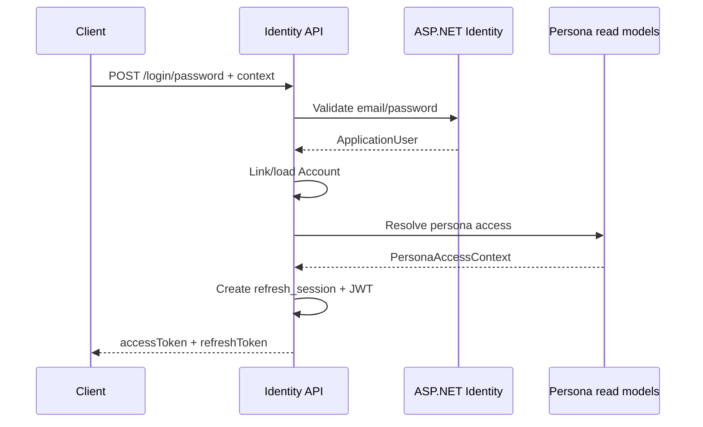
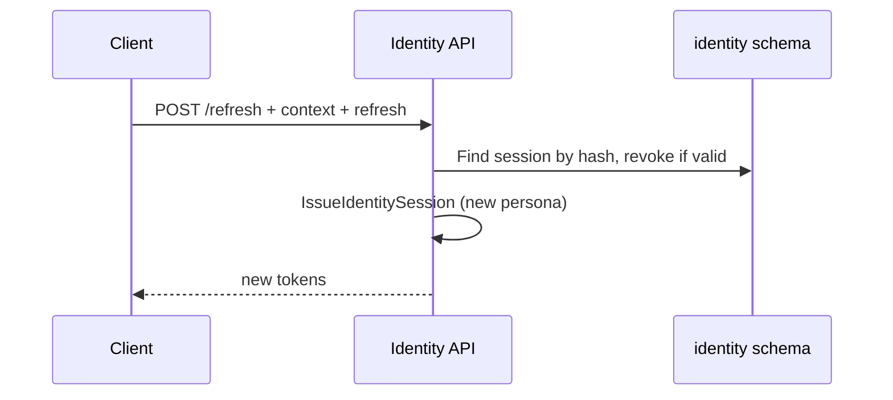

# Identity & authentication

## Architectural split

| Concern | Owner |
|---------|--------|
| Prove who signed in (`Account`, sessions, tokens) | **Identity** BC (`identity` schema) |
| Org membership, effective `claims[]`, preset role labels | **Tenancy** BC |
| Listener profile | **Listener** BC |
| Platform operators | **Platform** BC |

Identity **does not** store org ACLs or persona permissions. It validates persona choice at token mint time via **read-model ports** (`ITenancyPersonaReadModel`, `IListenerPersonaReadModel`, `IPlatformPersonaReadModel` in `Amuse.Modules/Identity/Contracts/`).

Auth approach (see also [`ads/auth/auth-flow.md`](../../ads/auth/auth-flow.md)):

- **Local password:** in-process ASP.NET Core Identity (`ApplicationUser` in Identity schema).
- **External:** generic OAuth2/OIDC completion (`authorization_code` + PKCE or `id_token`); Amuse issues its own tokens (IdP tokens are not API bearers).
- **Refresh:** proves `Account` only; **persona is not stored on `refresh_session`** — client sends desired persona on each `POST /refresh`.

## HTTP endpoints

All routes are under **`/api/v1/identity`**.

| Method | Path | Auth | Description |
|--------|------|------|-------------|
| `POST` | `/login/password` | No | Email/password sign-in; returns tokens for requested persona |
| `POST` | `/register/password` | No | Create local account; sends confirmation email (`202`) |
| `POST` | `/confirm-email` | No | Confirm email from registration link (`204`) |
| `POST` | `/resend-confirmation` | No | Resend confirmation email |
| `POST` | `/external/complete` | No | Complete external OAuth/OIDC login |
| `POST` | `/refresh` | No | New access token (+ rotated refresh) for given persona; also used to **switch persona** |
| `POST` | `/revoke` | No | Revoke refresh session; optionally blacklist current access `jti` |
| `GET` | `/me` | Bearer | Current `Account` profile |
| `GET` | `/personas` | Bearer | List personas available to the signed-in account |

There is **no** separate `POST /personas/select` — persona switching is **`POST /refresh`** with a new `context`.

### Request validation

- DTOs use **domain enums** (e.g. `PersonaContextType`) serialized as **camelCase** JSON (`org`, `listener`, `platform`).
- **FluentValidation** validators live next to features (`*RequestValidator.cs`).
- **`RequestValidationFilter`** runs on login, external complete, and refresh routes (`.WithRequestValidation()`).
- Invalid input → `400` validation problem; business failures → `400` problem with `code` extension (see errors below).

### Persona context (request body)

```json
{
  "type": "platform",
  "orgId": null,
  "listenerId": null
}
```

| `type` | Required fields | Rules |
|--------|-----------------|--------|
| `org` | `orgId` (non-empty GUID) | Must be active org member (Tenancy read model) |
| `listener` | `listenerId` (optional GUID) | If omitted, server resolves/creates the account listener profile (bootstrap). If set, profile must belong to account |
| `platform` | neither `orgId` nor `listenerId` | Account must be a platform operator |

Mapping: `PersonaContextMapper.ToDomain` → `Result<PersonaContext>` (no exceptions for bad input).

## Token transport

Header: **`X-Amuse-Client`**

| Client | Value | Refresh token | Access token |
|--------|-------|---------------|--------------|
| Web | `web` | HttpOnly cookie `amuse_refresh` (omitted from JSON body) | Response body |
| Mobile / default | omit or `mobile` | Response body | Response body |

Cookie `Secure` flag: **`false` in Development**, **`true` otherwise** (see `TokenTransport`).

### Response shape (`AuthTokenResponse`)

```json
{
  "accessToken": "<jwt>",
  "accessExpiresAt": "2026-05-16T12:00:00+00:00",
  "refreshToken": "<opaque or null for web>",
  "refreshExpiresAt": "2026-05-30T12:00:00+00:00"
}
```

Timestamps must be timezone-marked (offset or `Z`).

## Access token (JWT) claims

Minted by `TokenIssuer` in `Amuse.Modules/Identity/Auth/`:

| Claim | When |
|-------|------|
| `sub` | Account ID (GUID) |
| `ctx` | `org` \| `listener` \| `platform` |
| `org_id` | Org persona |
| `listener_id` | Listener persona |
| `org_role` | Preset role label (UI only; org persona) |
| `claims` | Repeated claim entries from read model |
| `jti` | Version 7 GUID (access tokens only) |

Validated on each request: issuer, audience, lifetime, signature (`Jwt` section in config).

## Refresh session

- Opaque refresh token stored hashed in `identity.refresh_session`.
- On refresh: old session **revoked**, new session issued (rotation).
- Refresh row does **not** store persona; client supplies `context` on every refresh.

## Revoke & JTI blacklist

`POST /revoke`:

1. Revokes matching **refresh session** (if refresh token provided via body or cookie).
2. If **`Authorization: Bearer <access>`** is present, parses `jti` + `exp` and inserts **`identity.token_blacklist`** until access expiry.
3. Clears refresh cookie (web).
4. Writes audit entry (`refresh_revoked`).

Subsequent API calls with that access token: JWT middleware checks blacklist → **`401`** with `identity.token_revoked`.

Refresh after revoke → `identity.invalid_refresh_token`.

## Auth flows (concrete)

### 1. Password login (mobile)



### 2. Password login (web)

Same as above, but client sends `X-Amuse-Client: web` and receives refresh token only in **`Set-Cookie: amuse_refresh`**.

### 3. Refresh / persona switch



Use the **same endpoint** when access JWT expires or user picks another org/listener/platform.

### Account registration (password + email confirmation)

1. `POST /register/password` with `{ email, password, portal }` where `portal` is `consumer` | `business` (camelCase JSON enum).
2. Server creates `ApplicationUser` + `Account` + listener profile; sends confirmation link via `IEmailSender` (dev: SMTP to [Mailpit](http://localhost:8025) when `Identity:Email:Smtp:Enabled` is true; otherwise logs the URL).
3. User opens `{portalBaseUrl}/confirm-email?userId=&token=` → frontend calls `POST /confirm-email`.
4. `POST /login/password` with listener bootstrap context: `{ type: "listener", orgId: null, listenerId: null }` (blocked until `EmailConfirmed`).

Config: `Identity:Email` (`RequireConfirmation`, `ConsumerAppBaseUrl`, `BusinessAppBaseUrl`, `ResendCooldownSeconds`, `Smtp`). Set `RequireConfirmation: false` locally to skip email for UI-only work.

**Dev mail (Mailpit):** `docker compose up -d mailpit` in `backend/` (or full stack). SMTP `localhost:1025`, web UI `http://localhost:8025`. With `dotnet run` on the host, `appsettings.Development.json` uses `Smtp.Host: localhost`. In compose, `amuse.api` uses `Smtp.Host: mailpit`. Set `Smtp.Enabled: false` to fall back to log-only `LogEmailSender`.

**Frontends:** `/signup`, `/confirm-email`, `/login` (with resend) on consumer (`:3000`) and business (`:3001`) apps.

### Account creation vs organization creation

**Adding an organization** is separate: an already-signed-in account uses [`/create-organization`](../../frontend/business/src/app/(auth)/create-organization/page.tsx) or `POST /tenancy/organizations`. Business portal redirects new accounts with zero org/platform personas to create-organization after sign-in.

### Business portal: first organization (signed-in account)

1. Sign in (`POST /identity/login/password` or restore session). Any persona context works for `POST /tenancy/organizations`; the UI uses [`/create-organization`](../../frontend/business/src/app/(auth)/create-organization/page.tsx) (optional entry from Settings / workspace picker).
2. `POST /api/v1/tenancy/organizations` with `{ displayName, orgClass }` (`indieGroup` \| `backingOrg`).
3. Refresh personas (`GET /identity/personas`) and switch org context via `POST /identity/refresh` with `context: { type: "org", orgId: <new id> }` (the portal calls `selectPersona` after create).
4. Use org access token for business APIs; persona listings include `onboardingStatus` for UI gating (e.g. pending banner for backing orgs).

See [`tenancy-organizations.md`](tenancy-organizations.md) for capability matrix and platform approval.

### 4. External login

`POST /external/complete` with `provider`, `grantType` (`authorizationCode` \| `idToken`), and grant-specific fields plus `context`.

- Resolves external subject via configured `ExternalProviders` (see `appsettings`).
- `AccountLinker` get-or-create `Account` by `(IdpIssuer, IdpSubject)`.
- Then same session issuance as password login.

### 5. Logout / revoke

`POST /revoke` with refresh (body or cookie) **and** `Authorization: Bearer <current access>` to invalidate access immediately.

### 6. Authenticated reads

- `GET /me` — account id, IdP issuer/subject, status.
- `GET /personas` — aggregates org/listener/platform listings via read models (no cross-BC DbContext access from Identity handlers).

## Domain errors (`IdentityErrors`)

| Code | Typical HTTP | When |
|------|--------------|------|
| `identity.invalid_credentials` | 400 | Bad email/password |
| `identity.email_already_registered` | 400 | Duplicate registration |
| `identity.email_not_confirmed` | 400 | Login before email confirmed |
| `identity.invalid_confirmation_token` | 400 | Bad or expired confirm link |
| `identity.registration_failed` | 400 | Identity user create failed (password rules, etc.) |
| `identity.resend_confirmation_rate_limited` | 400 | Resend cooldown |
| `identity.account_disabled` | 400 | Account not enabled |
| `identity.invalid_refresh_token` | 400 | Missing/invalid/expired refresh |
| `identity.invalid_persona_context` | 400 | Persona not allowed or malformed |
| `identity.external_login_failed` | 400 | External provider failure |
| `identity.token_revoked` | 401 | Blacklisted `jti` |

Problems use `title` = code, `detail` = message, extension `code` (see `ProblemDetailsMappingExtensions`).

## Configuration

| Section | Purpose |
|---------|---------|
| `ConnectionStrings:DefaultConnection` | Postgres |
| `Jwt` | Issuer, audience, signing key, access/refresh lifetimes |
| `ExternalProviders:Providers` | Named OIDC/OAuth2 provider definitions |
| `Platform:Root` | Seed root platform operator + optional dev `ApplicationUser` |

Dev defaults: [`backend/src/Amuse.Api/appsettings.Development.json`](../../backend/src/Amuse.Api/appsettings.Development.json).

## Code layout (Identity module)

```
Amuse.Modules/Identity/
  Features/<UseCase>/     # Endpoint, Request, Handler, Validator
  Auth/                   # TokenIssuer, AccountLinker, IssueIdentitySession, JWT blacklist
  Auth/External/          # OAuth/OIDC resolvers
  Contracts/              # Cross-BC read-model interfaces + DTOs
  Persistence/            # IdentityDbContext, migrations
  Options/                # JwtOptions, ExternalProviderOptions
  IdentityModule.cs       # DI + MapIdentityModule
```

**Not** a separate application-service layer: orchestration lives in **handlers**; shared minting is `IssueIdentitySession` (internal static helper only).

## Related schemas (other modules)

| Schema | Tables (relevant) |
|--------|-------------------|
| `identity` | `account`, `refresh_session`, `token_blacklist`, ASP.NET Identity tables |
| `tenancy` | `organization_member`, … |
| `listener` | `listener_profile` |
| `platform` | `platform_operator` (root `id = 1`) |
| `audit` | `audit_log` |
