# Amuse DA1 - Visual-First Presentation Script

## How To Use This File
- Keep each slide text minimal (3 to 5 bullets max).
- Put the Mermaid diagram or illustration as the main visual.
- Use the Speaker Notes section as your talking script.

---

## Slide 1 - Title
On-slide text:
- Amuse DA1
- Building a Fairer Cloud-Native Music Streaming Platform
- B2B2C, Secure Streaming, Monetization Logic

Visual:
- Illustration Placeholder: Split-screen hero image
- Left: listener with headphones using mobile app
- Right: artist dashboard and payout chart
- Background motif: streaming waveform + cloud infra nodes

Speaker Notes:
This project is not only about low-latency playback. It aims to combine listener convenience with creator-side fairness and platform governance.

---

## Slide 2 - Agenda
On-slide text:
- Industry context and platform gap
- DA1 problem framing and product definition
- Architecture choices and trade-offs
- Scope boundaries: DA1 vs DA2
- PoC status, risks, and advisor feedback asks

Visual (Mermaid):
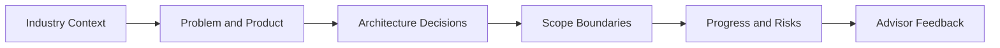

Speaker Notes:
This agenda sets expectations for a full narrative arc: why this project matters now, what DA1 must prove, which architecture decisions are intentional, and where we are in execution.

---

## Slide 3 - Industry Evolution (Physical -> Piracy -> Streaming)
On-slide text:
- Consumption shifted from physical media to digital
- Piracy exposed distribution weaknesses
- Legal on-demand streaming won on convenience

Visual (Mermaid):
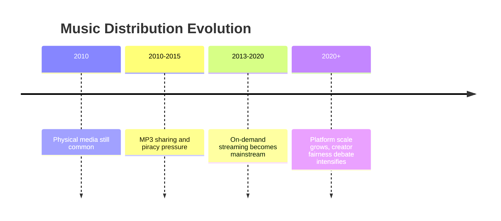

Speaker Notes:
The project starts from this industry transition: convenience improved, but fairness and ownership concerns remain unresolved.

---

## Slide 4 - Current Platforms: Strengths vs Gaps
On-slide text:
- Spotify/Apple Music: strong UX and discovery
- YouTube Music: strong UGC reach
- Bandcamp: stronger direct artist commerce
- Gap: no single model balances all three

Visual:
- Illustration Placeholder: 3-column comparison cards
- Card 1 Spotify/Apple, Card 2 YouTube Music, Card 3 Bandcamp
- Each card has two sections: strengths and structural limitations

Speaker Notes:
The opportunity is not to copy one platform. It is to combine streaming convenience with creator-first economics in one coherent architecture.

---

## Slide 5 - Problem Statement
On-slide text:
- Need secure adaptive streaming
- Need direct creator upload and governance
- Need transparent payout logic
- Must be feasible within DA1 timeline

Visual (Mermaid):
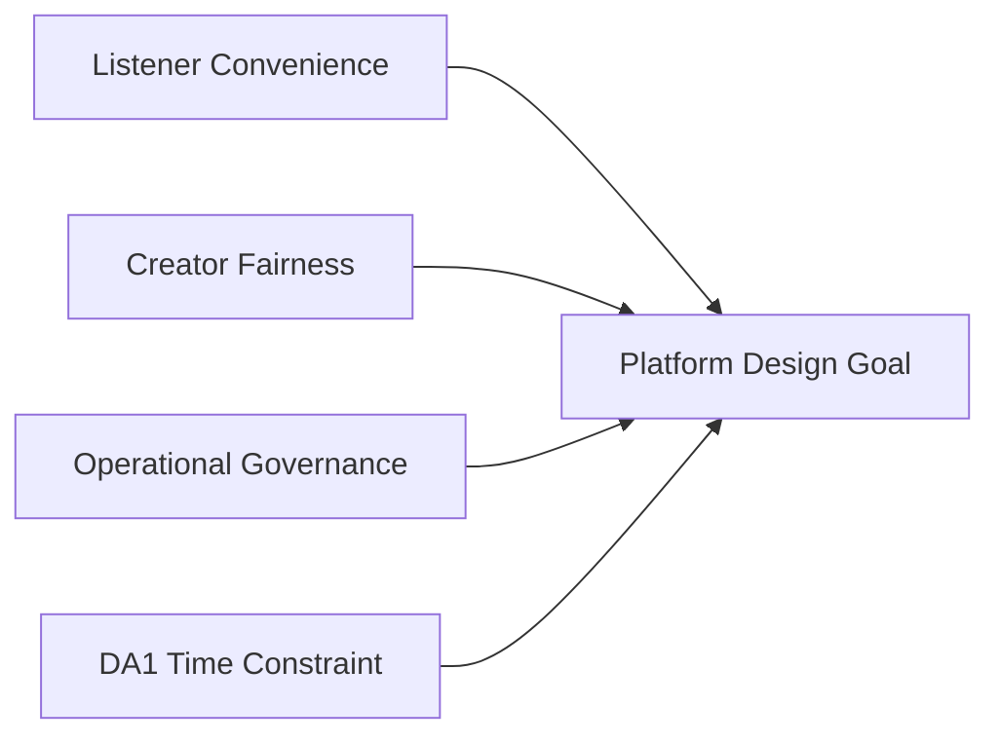

Speaker Notes:
Success means delivering a working vertical slice where playback, governance, and monetization are all internally consistent and testable.

---

## Slide 6 - Why B2B2C (Not B2C Only)
On-slide text:
- B2C only solves listening UX
- Missing business workflows without B2B
- B2B2C supports real content lifecycle

Visual (Mermaid):
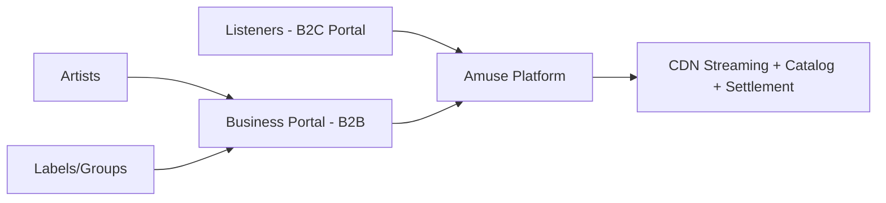

Speaker Notes:
B2B2C is required because upload governance, role permissions, moderation, and payouts are business-side concerns that B2C-only systems cannot model properly.

---

## Slide 7 - User and Role Model
On-slide text:
- Listener
- Artist
- Unverified Artist
- Label or Group
- Platform Admin

Visual:
- Illustration Placeholder: role map diagram
- Center node: Amuse Platform
- 5 role icons with labeled capabilities around center

Speaker Notes:
This role model is the basis for claims, permissions, discovery policy, moderation flow, and payout visibility.

---

## Slide 8 - Core Business Rules (Visual)
On-slide text:
- Verified-first search sections
- Unverified handling with policy toggle
- Auto-hide after report threshold
- Valid stream >= 30 seconds for settlement
- Balanced ledger entries only

Visual (Mermaid):
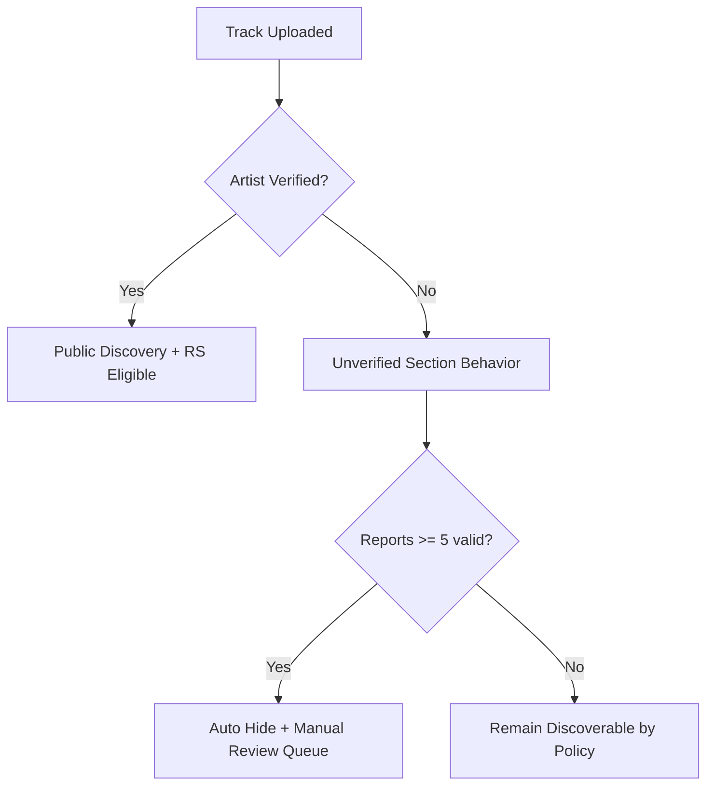

Speaker Notes:
These rules exist to balance openness for creators and quality control for listeners while preserving governance and business integrity.

---

## Slide 9 - Overall System Architecture
On-slide text:
- Two frontends, one platform core
- Async processing for heavy media tasks
- Cloud edge delivery for playback traffic
- Data and policy separation by responsibility

Visual (Mermaid):
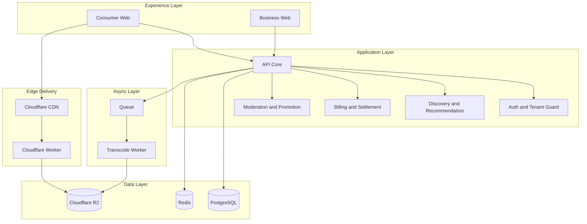

Visual add-on:
- Illustration Placeholder: cloud icon architecture board
- Include simple icons for browser, API, queue, worker, DB, cache, object storage, CDN edge

Speaker Notes:
This diagram gives the full architecture at a glance: product surfaces, core domain services, asynchronous processing, and edge media delivery.

---

## Slide 10 - CDN and Scalability Model
On-slide text:
- R2 for artifact storage
- CDN for high-volume delivery
- Short TTL for manifests, long TTL for segments
- Purge on moderation and republish events

Visual:
- Illustration Placeholder: layered architecture graphic
- Layer 1 client players, Layer 2 edge worker/CDN, Layer 3 object storage, Layer 4 control APIs

Speaker Notes:
The goal is to keep playback load off the core API while still enforcing policy and entitlement checks.

---

## Slide 11 - Decision 1: Monolith-First in DA1
On-slide text:
- Choice: modular monolith for DA1 core services
- Why: faster integration and lower coordination overhead
- What for: deliver complete end-to-end flows early
- Trade-off: fewer independent deploy and scale boundaries

Visual (Mermaid):
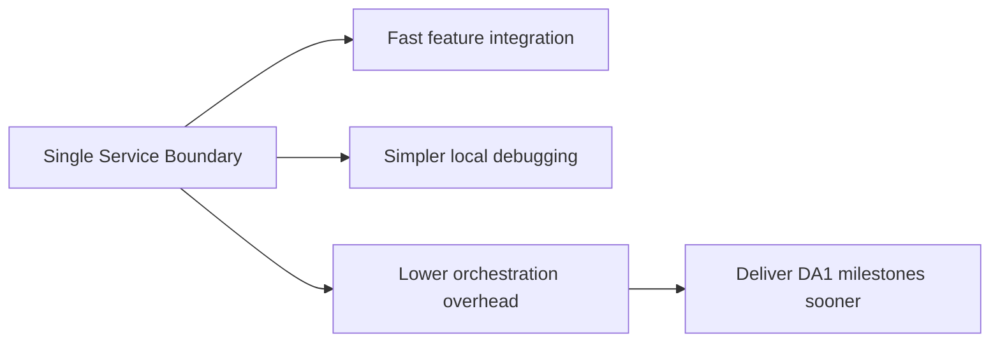

Speaker Notes:
This is a sequencing decision, not a denial of microservices. We optimize for delivery reliability in DA1, then split domains in DA2 when boundaries are validated.

---

## Slide 12 - Decision 2: Single DB + Tenant Isolation
On-slide text:
- Choice: single PostgreSQL database in DA1
- Why: operational simplicity and faster migration cycles
- What for: predictable data consistency across domains
- Trade-off: strict tenant guards are mandatory

Visual (Mermaid):
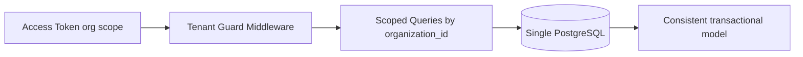

Speaker Notes:
This keeps data operations simple during DA1, while enforcing isolation through claims and query guards rather than separate databases per tenant.

---

## Slide 13 - Decision 3: DASH Primary, HLS Optional
On-slide text:
- Choice: DASH as default delivery protocol
- Why: focused adaptive baseline and implementation control
- What for: stable playback path for DA1 acceptance
- Trade-off: HLS compatibility is feature-flagged, not default

Visual (Mermaid):
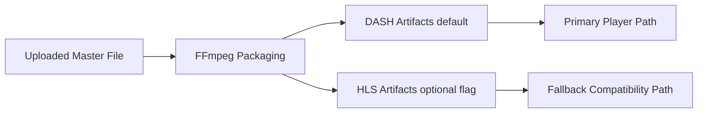

Speaker Notes:
The protocol choice is about delivery risk management. One strong default path is better than two partial paths that both fail quality targets.

---

## Slide 14 - Decision 4: Mock Payment in DA1
On-slide text:
- Choice: mock provider callbacks, real ledger logic
- Why: legal and compliance onboarding exceed DA1 timeline
- What for: validate revenue and payout business correctness
- Trade-off: no real-money transaction path in demo

Visual (Mermaid):
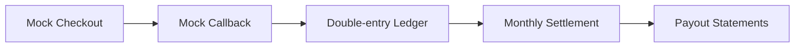

Speaker Notes:
This preserves financial logic integrity while removing external legal blockers. DA1 proves correctness of accounting flow, not payment vendor contracts.

---

## Slide 15 - Decision 5: K3s Dev, AKS Demo
On-slide text:
- Choice: local-first K3s for daily build loops
- Why: cost control and faster iteration
- What for: reserve AKS for release-hardening and demo proof
- Trade-off: must validate environment parity before final release

Visual (Mermaid):
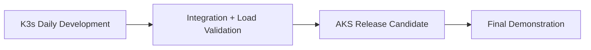

Speaker Notes:
This strategy minimizes cloud burn during development while still proving cloud-native deployment in the final evaluation window.

---

## Slide 16 - Streaming Security: Why Edge Authorization
On-slide text:
- Media URLs are the real attack surface
- API-only auth is not enough
- Every manifest and segment must be token-validated
- Fail-closed: deny if invalid

Visual (Mermaid):
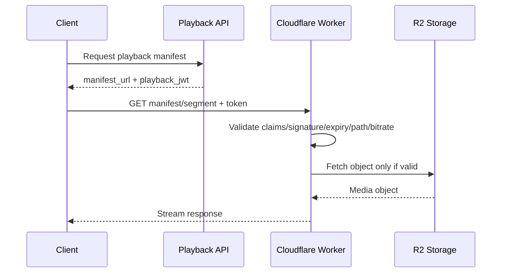

Speaker Notes:
This is chosen to protect assets at the delivery path itself, not just at API boundaries.

---

## Slide 17 - Scope Framework (How Scope Is Decided)
On-slide text:
- Scope axis 1: business value for DA1 grading
- Scope axis 2: delivery risk within timeline
- Scope axis 3: dependency criticality (blocks other work or not)
- Rule: DA1 keeps only high-value, dependency-critical items

Visual (Mermaid):
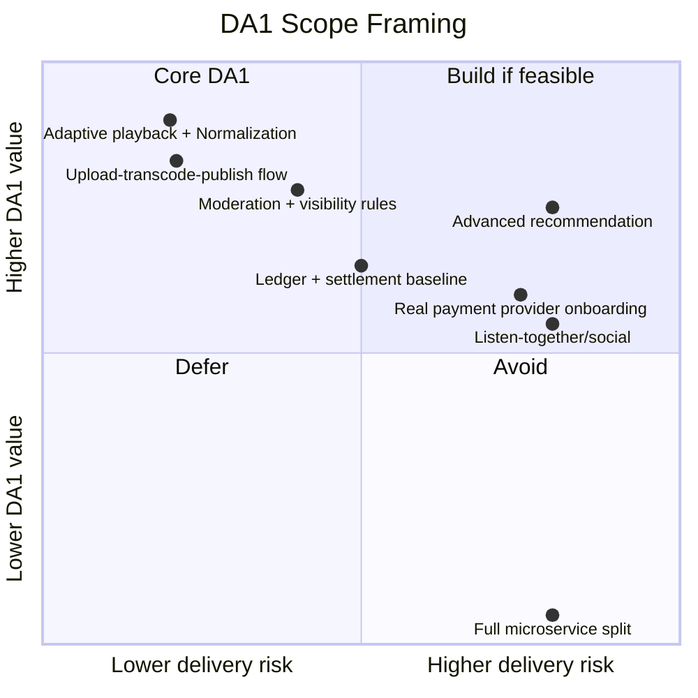

Speaker Notes:
This framework is used to stop scope creep. If a feature is high risk and non-blocking, it moves out of DA1 unless it directly impacts mandatory acceptance criteria.

---

## Slide 18 - DA1 In-Scope (Detailed)
On-slide text:
- Identity and multi-tenant access control
- B2B catalog and upload workflow
- Adaptive playback path (DASH-first)
- Discovery, playlist, recommendation baseline
- Moderation, promotion gates, and governance
- Mock billing, ledger, and monthly settlement
- CI/CD, observability, and benchmark evidence

Visual:
- Illustration Placeholder: scope checklist board
- 7 horizontal lanes with progress markers: Auth, Catalog, Playback, Discovery, Governance, Finance, Ops

Speaker Notes:
This is the official DA1 delivery contract. Each item maps to requirements and acceptance tests, so scope is measurable rather than narrative.

---

## Slide 19 - DA1 Out-of-Scope (Explicit Defer List)
On-slide text:
- Full microservice decomposition across all domains
- Real payment legal onboarding and live payout rails
- Listener personal music uploads and custom library
- Lyrics display and time-synced karaoke features
- Advanced social features (listen-together, comments, campaigns)
- Advanced recommendation stack requiring heavy data infra
- Full legal compliance implementation across regions

Visual (Mermaid):
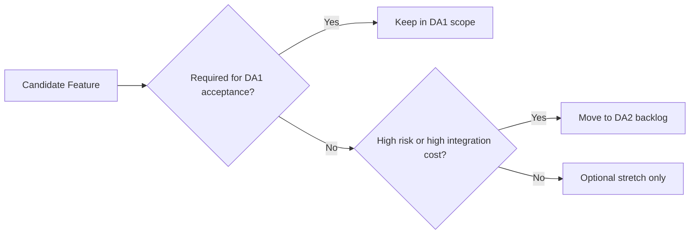

Speaker Notes:
This list protects delivery quality. Deferred does not mean unimportant; it means sequenced for the right phase.

---

## Slide 20 - Why ML Recommendation Is Out of Scope in DA1
On-slide text:
- DA1 keeps recommendation at baseline heuristic level
- No ML training pipeline, feature store, or model serving in DA1
- No large-scale behavior telemetry loops for model optimization
- Goal in DA1: correctness, governance, and delivery reliability first
- ML recommendation is a planned DA2 expansion track

Visual (Mermaid):
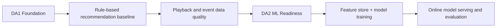

Speaker Notes:
ML recommendation is intentionally deferred because it depends on clean historical data, robust MLOps, and experimentation loops. DA1 focuses on producing the trusted data and product foundation needed before ML investment.

---

## Slide 21 - DA1 vs DA2 Boundary Map
On-slide text:
- DA1 goal: prove core platform correctness
- DA2 goal: expand scale and product breadth
- DA1 outputs become DA2 foundation artifacts

Visual (Mermaid):
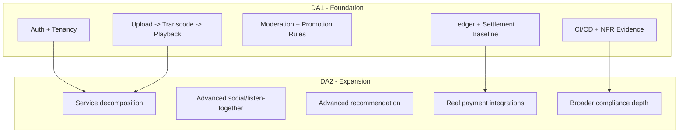

Speaker Notes:
The point of this boundary map is continuity: DA1 is not a throwaway prototype. It intentionally creates reusable technical and business artifacts for DA2.

---

## Slide 22 - Scope Guardrails During Implementation
On-slide text:
- Guardrail 1: no new domain unless one existing milestone is closed
- Guardrail 2: no infra expansion before end-to-end user flow passes
- Guardrail 3: no feature enters DA1 without acceptance test owner
- Guardrail 4: if schedule slips, cut breadth before cutting integrity

Visual:
- Illustration Placeholder: "scope firewall" diagram
- Left: incoming feature requests
- Middle: guardrail gate checks
- Right: DA1 committed backlog vs DA2 backlog

Speaker Notes:
These guardrails are practical controls to keep the project finishable. The team should cut optional breadth first, never tenant security, settlement correctness, or playback reliability.

---

## Slide 23 - PoC Progress (What Exists Now)
On-slide text:
- API skeleton for auth, playback, events, health
- Mock JWT with org and tier claims
- Org-scope checks in playback flow
- Local DASH artifact serving
- Multi-service local compose setup

Visual:
- Illustration Placeholder: screenshot collage
- 1 backend endpoint list screenshot
- 1 local compose services screenshot
- 1 playback test response screenshot

Speaker Notes:
Current status is a scaffolding PoC that validates architecture shape, not full DA1 completion.

---

## Slide 24 - Gap: PoC to DA1 Completion
On-slide text:
- DB-backed domain persistence
- Redis blacklist and caching
- Real queue-driven transcode pipeline
- Full B2B/B2C feature completion
- Edge deployment and purge automation
- NFR benchmarks and AKS CI/CD evidence

Visual (Mermaid):
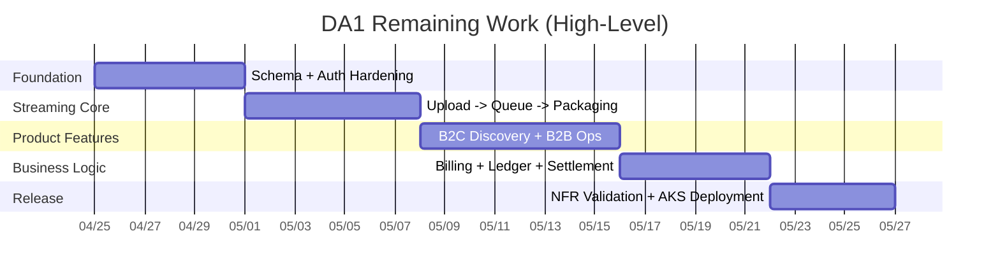

Speaker Notes:
This slide keeps progress reporting honest and execution-oriented.

---

## Slide 25 - Risks and Mitigation
On-slide text:
- Scope creep
- Infra complexity before core flows
- Transcode backlog risk
- Tenant and finance integrity risk

Visual (Mermaid):
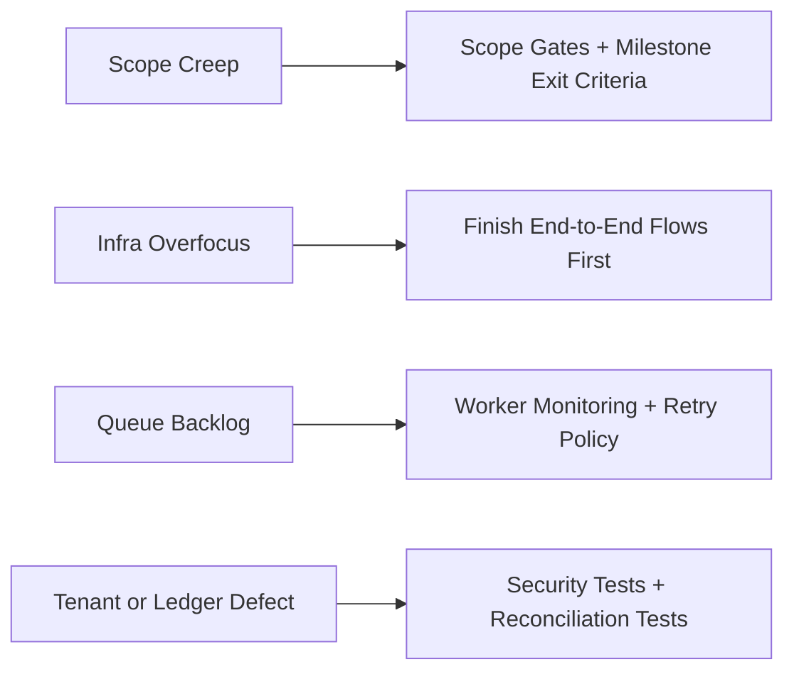

Speaker Notes:
Risk management is part of architecture, not a separate afterthought.

---

## Slide 26 - What Success Looks Like for DA1
On-slide text:
- Secure adaptive playback works end-to-end
- Business operations and moderation are enforceable
- Settlement baseline is reproducible and auditable
- Performance targets and deployment evidence are documented

Visual:
- Illustration Placeholder: final "definition of done" dashboard
- Four status cards: Playback, Governance, Finance, Ops
- Each card has green/yellow/red indicator for demo review

Speaker Notes:
DA1 success is measured by coherence, testability, and operational evidence, not by feature count alone.

---

## Slide 27 - Advisor Questions
On-slide text:
- Is this DA1 scope cut appropriate?
- Keep DASH-first if timeline tight?
- Is recommendation baseline sufficient?
- Are milestone priorities aligned with grading?

Visual:
- Illustration Placeholder: clean closing slide with roadmap arrow DA1 -> DA2

Speaker Notes:
Closing statement: The strategy is to deliver a secure, measurable core now, then expand breadth in DA2 once the foundation is proven.

---

## Optional Backup Slide A - Detailed System Architecture
Visual (Mermaid):
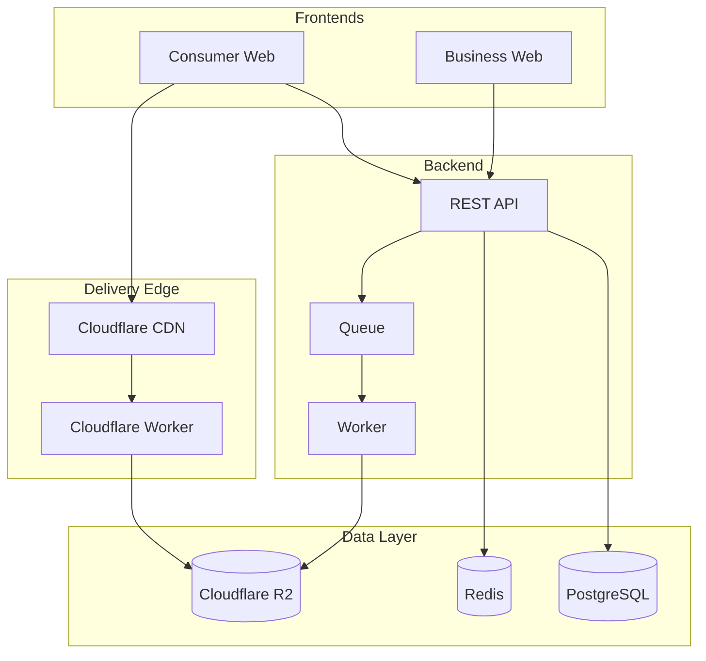

---

## Optional Backup Slide B - Settlement Logic Snapshot
Visual (Mermaid):
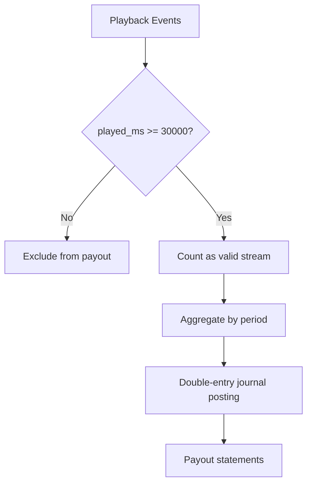
